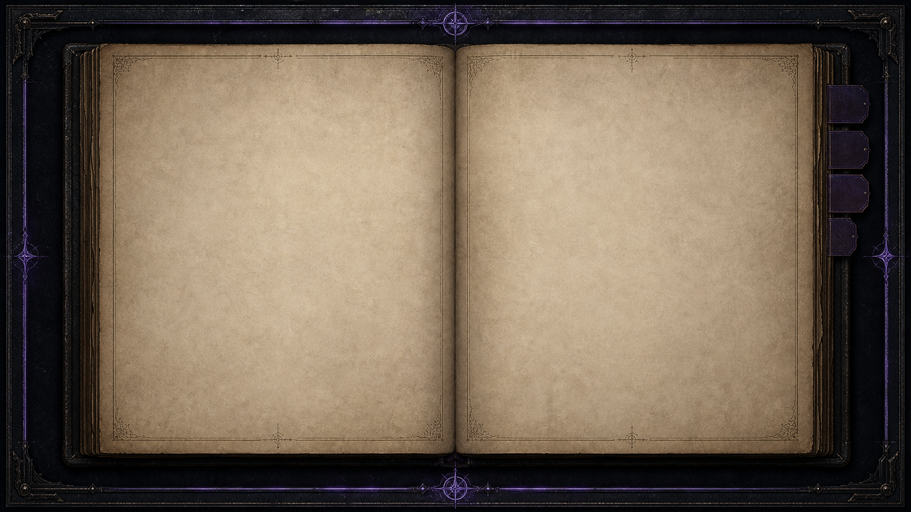

# 괴이 기록국 이미지 인덱스

> 문서 위치: `[기획서]/이미지_인덱스.md` | 상위 책임 원본: [`03_아트기획서.md`](03_아트기획서.md) | 상태 기준: `codex/mvp048-campaign-novel`의 `4cf39a2`

이 인덱스는 최신 이미지의 **경로·용도·참조·QA 증거**를 한곳에서 관리한다. 활성 기획서는 아니며, 아트 기획서의 부록이다. 게임/UX/QA 문서는 이미지를 복제하지 말고 이 항목을 링크한다.

## 빠른 시각 확인

아래 이미지는 인덱스의 대표 항목을 바로 확인하기 위한 실제 자산·QA 캡처다. 각 이미지의 최신성, 제작 정보, 교체 여부는 아래 표의 ID를 기준으로 판단한다.

### ART-QA-01 — 저승역 조사 화면

### ART-QA-02 — 저승역 4×4 최종 검증

### ART-CHAR-01 — 권나래 전신 게임 자산

  

### ART-UI-01 — 열린 책 매뉴얼 텍스처

## MVP-043 캐릭터 패키지 원본 감사

> 외부 원본 위치: `C:\Users\user\Desktop\비교샷\도시괴담\MVP-043_캐릭터_이미지_패키지_v1.0.zip` | 저장소 보존 경로: `assets/source/mvp043_character_v1/` | 확인일: 2026-07-17

사용자 제공 ZIP은 이동·수정하지 않았다. 아래 10개 파일은 ZIP 스트림과 저장소 보존 사본의 SHA-256을 비교해 **10/10 바이트 동일**을 확인했다. 원본 카드에는 한글 이름·직책·UI가 구워져 있으므로 게임 화면에는 직접 사용하지 않고, manifest가 가리키는 텍스트 없는 파생 자산의 참고 원본으로만 사용한다.

| 패키지 항목 | 저장소 원본 사본 | 게임용 파생 자산 | 감사 결과 |
|---|---|---|---|
| 00 전체 캐릭터 라인업 | `lineup.png` | 직접 사용 안 함 / 전체 방향 참조 | SHA-256 동일 |
| 01 권나래 | `kwon_narae.png` | 전신·반신·조사 지원·회수 지원 | SHA-256 동일 |
| 02 윤서하 | `yoon_seoha.png` | 전신·반신·조사 지원·회수 지원 | SHA-256 동일 |
| 03 오현 | `oh_hyun.png` | 전신·반신·조사 지원·회수 지원 | SHA-256 동일 |
| 04 강이준 | `kang_ijun.png` | 전신·반신·조사 지원·회수 지원 | SHA-256 동일 |
| 05 한유리 | `han_yuri.png` | 전신·반신·조사 지원·회수 지원 | SHA-256 동일 |
| 06 박도윤 | `park_doyoon.png` | 반신·HQ 외부 접점 장면 | SHA-256 동일 |
| 07 이세린 | `lee_serin.png` | 반신·HQ 외부 접점 장면 | SHA-256 동일 |
| 08 레이먼드 케인 | `raymond_kane.png` | 반신·HQ 외부 접점 장면 | SHA-256 동일 |
| 09 카밀라 바르가스 | `camila_vargas.png` | 반신·HQ 외부 접점 장면 | SHA-256 동일 |

파생 자산의 실제 경로·크기·알파·프롬프트·QA는 [`assets/characters/mvp043/ASSET_MANIFEST.json`](../assets/characters/mvp043/ASSET_MANIFEST.json)을 정본으로 사용한다. 패키지가 교체되면 이 표, source 사본, manifest 참조, 실제 장면 캡처를 같은 작업에서 함께 심사한다.

| ID | 대상/용도 | 게임 자산 또는 증거 경로 | 상태 | 다음 확인 |
|---|---|---|---|---|
| ART-UI-01 | 저승역 열린 책·매뉴얼 배경 | `assets/ui/afterlife/manual_book_frame.png` | 구현 확인 | 실시간 텍스트 대비와 페이지 여백 |
| ART-UI-02 | 저승역 금속 패널 | `assets/ui/afterlife/generated/afterlife_metal_panel_v1.png` | 구현 확인 | 1280×720 조사 화면 캡처 |
| ART-UI-03 | 3×3/4×4 노선 타일 표면 | `assets/ui/afterlife/generated/route_tile_base_v1.png` | 구현 확인 | 연결·고착·가짜 목적지 상태 가독성 |
| ART-CHAR-01 | 초기 5인 및 외부 4인 컬렉션 | `assets/characters/mvp043/ASSET_MANIFEST.json` | 구현 확인 | 전신·반신·지원 장면의 런타임 크롭 |
| ART-CUT-01 | 기존 3인 투명 컷아웃 | `assets/agents/cutouts/` | 구현 확인 | 대화/회수 장면 겹침 없음 |
| ART-CUT-02 | 괴이 투명 컷아웃 | `assets/anomalies/cutouts/` | 구현 확인 | 위험 단계의 명암·텍스트 대비 |
| ART-QA-01 | 저승역 조사·책 매뉴얼 캡처 | `docs/qa/captures/mvp043/ui_replacement/` | 증거 존재 | 최신 UI와 다시 비교 |
| ART-QA-02 | 팀·조사·회수·외부 접점 캡처 | `docs/qa/captures/mvp043/integrated/` | 증거 존재 | 현재 진행 브랜치와 재캡처 |
| ART-NEW-01 | 네 번째 사건 시각 자료 | 아직 미등록 | 미구현 | 배경/초상/컷인 필요를 확정 후 등록 |

## 항목을 추가·교체할 때의 필수 메타데이터

`ID / 목적 / 원본 또는 참조 카드 / 생성 프롬프트 / 실제 경로 / 크기 / 알파 의도·결과 / 텍스트 미포함 여부 / 런타임 장면 / 1280×720·1920×1080 QA 캡처 / 확인일`을 남긴다. 원본 참고 자료는 삭제·덮어쓰기하지 않으며, 오래된 항목은 대체 ID와 함께 아카이브한다.
