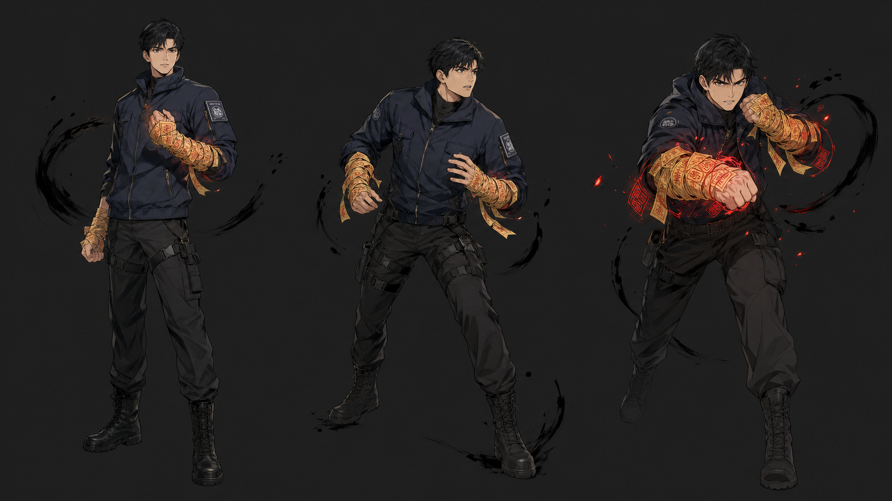
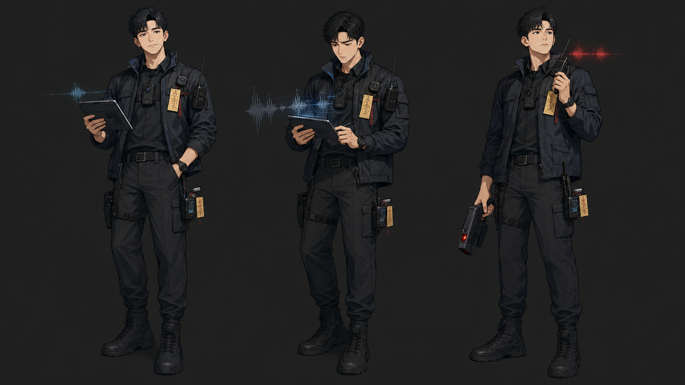

# 괴담기록국 게임기획서

> 기준 원본: 이 Markdown 문서가 게임 설계의 편집 원본이다.
> 배포본: `docs/URBAN_LEGEND_GAME_DESIGN.docx`
> 갱신 규칙: 이 문서가 바뀌면 DOCX를 재생성하고, 완료 보고에서 두 파일을 사용자에게 모두 보여준다.

| 항목 | 현재 값 |
|---|---|
| 문서 버전 | v0.3 |
| 문서 상태 | MVP-038 기준 상세 통합 설계 + MVP-039 텍스트 조사 UX 구현 |
| 기준 게임 버전 | Ver 3.8 |
| 저장 스키마 | mvp-038 |
| 기준일 | 2026-07-14 |
| 1차 플랫폼 | PC / Steam, 16:9, 마우스·키보드 |


*현재 프로젝트 에셋을 사용한 분위기 기준 이미지. 게임 화면 배치 확정안이 아니라 세계관·조명·색채 기준이다.*

## 문서 사용 기준

이 문서는 사람, GPT, Codex가 같은 게임을 설명하고 같은 현재 상태에서 작업하기 위한 살아 있는 기획서다. 세부 구현 사실은 실제 코드와 데이터가 우선하며, 충돌이 발견되면 이번 작업에서 문서를 갱신하거나 차이를 보고한다.

| 상태 | 의미 |
|---|---|
| 구현 확인 | 현재 `main`의 코드·데이터·테스트에서 확인한 기능 |
| 확정 설계 | 구현 기준으로 승인됐으나 콘텐츠 또는 QA가 더 필요한 방향 |
| 계획 | 로드맵에 있으나 아직 완성되지 않은 범위 |
| 미확정 | 플레이테스트나 사용자 결정이 필요한 항목 |

### 설계 판단 규칙

각 설계 항목은 **플레이어가 무엇을 보고, 어떤 판단을 하며, 어떤 상태 변화와 기록을 받는가**까지 적는다. 구현 확인은 코드·데이터로 재확인하고, 확정 설계는 다음 MVP의 수용 기준을, 계획은 선행 조건을, 미확정은 결정 질문을 함께 남긴다. 이 문서는 긴 서사 대본이나 구현 코드의 대체물이 아니며, 둘은 각각 사건 데이터와 실제 파일을 원본으로 삼는다.

직접 수정하는 문서는 이 Markdown뿐이다. DOCX는 다음 명령으로 갱신한다.

```powershell
& "C:\Users\user\.cache\codex-runtimes\codex-primary-runtime\dependencies\python\python.exe" tools/docs/build_game_design_doc.py --build
& "C:\Users\user\.cache\codex-runtimes\codex-primary-runtime\dependencies\python\python.exe" tools/docs/build_game_design_doc.py --check
```

## 1. 게임 개요

| 항목 | 내용 | 상태 |
|---|---|---|
| 제목 | 괴담기록국 | 확정 설계 |
| 장르 | 현대 오컬트 미스터리, 텍스트 노벨형 조사 어드벤처, 팀 운영 | 확정 설계 |
| 핵심 한 문장 | 요원 팀을 편성해 도시괴담의 규칙을 조사하고, 단서를 근거로 괴이를 안정화·회수한다. | 구현 확인 |
| 플레이어 역할 | 고정 주인공이 아니라 괴담기록국 요원 팀의 지휘·판단 담당 | 구현 확인 |
| 핵심 원칙 | 괴담은 죽이는 게 아니라, 규칙을 밝혀 봉인하는 것이다. | 확정 설계 |
| 목표 플레이타임 | 필수 125~155분, 선택 콘텐츠 포함 180~220분 | 계획 |

## 2. 핵심 플레이어 경험

- 낯선 도시괴담 현장에 투입되는 긴장감을 느낀다.
- 상황과 단서를 읽고 조사 방식을 선택한다.
- 실패해도 다음 판단에 쓸 관찰 정보와 패턴 학습이 남는다.
- 서로 다른 능력과 반응을 가진 요원을 수사 파트너로 운용한다.
- 괴이를 처치하지 않고 규칙을 이해해 안정화·회수한다.
- 사건 보고서와 기록국 DB에서 자신이 만든 기록을 다시 확인한다.

### 디자인 불변 조건

| 유지할 방향 | 제외할 방향 |
|---|---|
| 단서에 근거한 페어플레이 추리 | 단서 없는 반전과 찍기식 정답 |
| 상황 설명 → 선택 → 짧은 결과 | 조사 중 장문 대사와 상시 팝업 |
| 피해를 줄이고 규칙을 봉인·회수 | HP·공격·처치 중심 RPG 전투 |
| 요원의 기여와 짧은 반응 | 요원을 수치 카드나 연애 호감도로 축소 |
| 실패에서 학습 가능한 기록 | 실패 즉시 진행 차단 또는 거짓 정보 |

### 플레이어 경험 수용 기준

| 순간 | 플레이어가 이해해야 하는 것 | 성공 신호 | 실패·혼란 신호 | 상태 |
|---|---|---|---|---|
| 반일 계획 | 지금 할 수 있는 활동과 미룰 때의 위험 | 한 번의 화면 확인 뒤 조사·휴식·의뢰를 선택한다 | 사건을 고르지 못하거나 다음 반일로 바로 넘어가려 한다 | 구현 확인 |
| 현장 조사 | 현재 상황, 선택지의 차이, 이미 얻은 정보 | 선택 이유를 한 문장으로 설명할 수 있다 | 무엇을 다시 확인해야 하는지 전혀 알 수 없다 | 확정 설계 |
| 단서·힌트 | 확보한 근거와 다음 탐색 방향의 차이 | 힌트 없이도 단서의 의미를 보고서에서 재확인한다 | 힌트가 정답·숨은 수치를 직접 말한다 | 확정 설계 |
| 회수 | 확보 근거가 대응 선택과 연결되는 이유 | 정답·오대응의 이유를 전조와 기록으로 되짚는다 | 반사 신경이나 수치만으로 결과가 결정된다 | 확정 설계 |
| 결과·DB | 이번 판단이 다음 조사에 남긴 것 | 단서·피해·요원 기여·다음 선택을 구분한다 | 결과가 보상 나열로 끝나고 사건 의미가 사라진다 | 구현 확인 |

## 3. 세계관과 표현

괴담기록국은 도시에서 반복되는 비정상 규칙을 발견하고 기록하며, 피해 확산을 막고 괴이의 핵을 회수하는 기관이다. 기록국은 사건을 없던 일로 만들기보다 재현 조건과 대응 절차를 남긴다.

- 현대 도시의 익숙한 장소와 비현실적인 반복 규칙을 함께 사용한다.
- 피해·사망·후유증은 농담 소재로 삼지 않는다.
- 대사는 일상 콘텐츠에서 풍부하게, 조사에서는 짧게 쓴다.
- 미확보 단서, 정답, 숨은 수치를 안내자가 누설하지 않는다.

## 4. 전체 게임 흐름

```text
신규 캠페인
→ 현재 반일 계획
→ 요원별 조사·휴식·세력 의뢰 배치
→ 조사 사건 선택(조사 배치가 있을 때만)
→ 현장 상황·선택·결과
→ 현장 판정 또는 미니게임
→ 괴이 안정화·회수
→ 반일 결과 확인
→ 다음 반일 또는 다음 날
→ 사건 보고서·기록국 DB·연구·시장
→ 데모 종료 판단
```

### 세 층의 진행 루프

| 층 | 반복 단위 | 플레이어 행동 | 남는 변화 | 설계 경계 |
|---|---|---|---|---|
| 분 단위 | 현장 선택 1회 | 상황 읽기, 조사 방식 또는 대응 선택 | 단서·힌트·위험·이해도·요원 반응 | 선택지는 서로 다른 정보·위험·접근 방식을 가져야 한다 |
| 사건 단위 | 조사부터 보고서까지 | 근거를 모으고 규칙을 검증해 회수 | 보고서·기록물·패턴 학습·관계 변화 | 미니게임은 규칙 검증을 보조하며 독립 액션 과제가 아니다 |
| 캠페인 단위 | 오전 또는 오후부터 다음 반일까지 | 일정·요원·의뢰·위험을 관리 | 사건 위험, 세력 관계, 장비·연구 접근 | 시장·자동행동이 핵심 추리를 대신하지 않는다 |

### 첫 30분 온보딩 계약

| 구간 | 플레이어에게 주는 약속 | 확인할 행동 | 정보 공개 경계 | 상태 |
|---|---|---|---|---|
| 첫 계획 | 팀을 운용하며 반일 하나를 선택한다 | 조사 또는 휴식·의뢰의 차이를 확인한다 | 세 사건의 결말과 숨은 조건은 공개하지 않는다 | 확정 설계 |
| 첫 현장 | 짧은 상황과 선택으로 괴담 규칙을 읽는다 | 조사 지점·방식을 하나 선택한다 | 미확보 단서 대신 관찰 가능한 위험과 목표만 보여준다 | 구현 확인 |
| 첫 실패 또는 우회 | 실수도 학습 기록을 남긴다 | 결과에서 원인·피해·다음 근거를 구분한다 | 정답을 직접 설명하거나 강제로 재시도시키지 않는다 | 확정 설계 |
| 첫 회수·보고서 | 근거를 사용해 괴이를 안정화한다 | 근거와 대응의 연결을 보고서에서 되짚는다 | 장기 연구·세력 콘텐츠는 한 번에 과다 노출하지 않는다 | 확정 설계 |


## 5. 10일 캠페인과 순차 반일 운영

| 규칙 | 현재 적용 | 상태 |
|---|---|---|
| 캠페인 길이 | 최대 10일 | 구현 확인 |
| 시간 슬롯 | 오전·오후 | 구현 확인 |
| 진행 순서 | 현재 반일 계획 → 실행 → 결과 확인 후 다음 반일 계획 | 구현 확인 |
| 기본 활동 | 조사, 휴식, 수락한 파견 의뢰 | 구현 확인 |
| 사건 선택 | 조사 배치가 있을 때만 선택 | 구현 확인 |
| 조사 중 HQ 복귀 | 같은 사건·날짜·반일을 중단 상태로 보존하고 재개 | 구현 확인 |
| 위험도 상승 | 기본 1건, 확산이 높을 때 최대 2건 순환 상승 | 구현 확인 |
| 폭주 | 즉시 게임 오버가 아니라 긴급 조사·포기 판단 | 확정 설계 |
| 일상 이해도 | 최초 +2, 후속 +1, 하루 1회, 사건별 최대 +10 | 확정 설계 |

## 6. 사건 상태와 콘텐츠

| 사건 | 현재 상태 | 콘텐츠 범위 | 다음 작업 |
|---|---|---|---|
| 저승역 | 구현 확인 | 5단서, 5힌트, 통합 현장 노드, 폐주파수 판정, 회수·보고서 | 전체 플레이 문구·밸런스 QA |
| 비 오는 골목의 빨간 우산 | 구현 확인 | 3단서, 3힌트, 통합 현장 노드, 빗소리/회피 판정, 회수·보고서 | 전체 플레이 문구·밸런스 QA |
| 폐주파수 방송국 | 계획 | 캠페인 상태에서 미확인 사건으로 존재 | 에피소드 JSON·현장·회수 콘텐츠 제작 |
| 일상 에피소드 | 계획 | 선택 콘텐츠와 이해도 보상 계약만 존재 | 요원 2~3명 관계 중심 콘텐츠 작성 |

일상 에피소드는 건너뛰어도 필수 단서, 조사, 회수, 엔딩 진행에 영향을 주지 않는다.

### 사건 설계 카드와 콘텐츠 수용 기준

모든 신규 사건은 아래 카드로 먼저 승인한 뒤 데이터·대사·씬 작업으로 나눈다. 숫자·고유 명칭·결말을 미확정 상태에서 채우지 않는다.

| 카드 항목 | 구현 사건 기준 | 계획 사건 기준 |
|---|---|---|
| 사건 약속 | 장소의 일상성과 반복되는 비정상 규칙을 한 문장으로 제시 | 플레이어가 처음 듣는 괴담과 확인 가능한 위험을 제시 |
| 조사 목표 | 회수에 필요한 근거와 접근 가능한 조사 지점이 데이터에 존재 | 단서·힌트·현장 노드 수를 확정하기 전 `미확정`으로 유지 |
| 페어플레이 | 회수 대응의 핵심 근거가 현장·기록·결과에 남는다 | 정답을 새 정보로 뒤집지 않는 증거 배치를 검토 |
| 실패 설계 | 피해 또는 불안정과 패턴 학습·보고서 기록이 남는다 | 진행 차단 없이 무엇을 배울지 먼저 정함 |
| 회수 장면 | 전조, 대응, 괴이 반응, 자동 보조, 결과가 연결된다 | 사건 고유 규칙을 표현하는 대응 수와 전조를 정의 |
| 보고서·DB | 단서·힌트·판정·기여·보상·다음 연결을 요약한다 | 플레이어가 다음 사건에서 다시 쓸 기록물을 결정 |

신규 사건의 수용 기준은 “플레이어가 회수 전 최소 하나의 근거를 스스로 설명할 수 있는가”, “실패 후에도 다음 선택의 근거가 남는가”, “장비·요원 보정 없이도 핵심 대응을 추론할 수 있는가”다.

## 7. 조사와 정보 구조

### 현장 기본 단위

1. 현재 상황을 짧게 설명한다.
2. 조사 지점과 조사 방식을 비교한다.
3. 선택 결과와 요원 반응을 보여준다.
4. 새 단서·힌트·위험·이해도 변화를 구분해 기록한다.
5. 충분한 근거가 쌓이면 회수에 진입한다.

### 단서와 힌트

| 구분 | 역할 | 회수 영향 |
|---|---|---|
| 단서 | 괴이 규칙을 입증하는 확보 정보 | 자동 근거·대응 조건·보고서에 사용 |
| 힌트 | 아직 찾지 못한 단서로 향하는 방향 | 단서 수집률에 포함하지 않음 |
| 패턴 학습 | 실패·오대응 뒤 남는 다음 판단 근거 | 같은 실수를 줄이되 정답은 공개하지 않음 |
| 기록물 | 완료 사건에서 축적하는 장기 참고 자료 | 이후 조사 보조와 DB 연결 |

### 조사 방식

기존 데이터 호환을 위해 파괴·관찰·분석 방식이 남아 있다. 현재 요원 설계의 5능력과 연결할 때는 선택 순간에 필요한 능력만 노출하며, 전체 수치판을 조사 화면에 상시 표시하지 않는다.

### 조사 UX와 페어플레이 규칙

| 규칙 | 플레이어 표면 | 내부·문서 확인 | 금지 |
|---|---|---|---|
| 조사 완료감 | 이미 확인한 지점과 새 지점을 구분할 수 있다 | 단서·힌트 획득과 결과 기록이 보고서에 남는다 | 존재하지 않는 단서를 끝없이 찾게 하는 상태 |
| 힌트 단계 | 힌트는 “무엇을 다시 보라”는 방향만 준다 | 첫 상세 안내 뒤에는 짧은 재방문 안내를 사용한다 | 다음 클릭 위치·정답·숨은 수치 직접 공개 |
| 선택 비교 | 선택 전 위험·접근 방식·필요 근거의 차이를 읽는다 | 선택 결과는 원인과 상태 변화를 짧게 기록한다 | 의미 없는 색만 다른 선택지 |
| 실패 후 학습 | 오대응 뒤 전조·패턴·피해를 확인한다 | 패턴 학습은 다음 판단을 돕되 성공을 보장하지 않는다 | 거짓 예측·무설명 즉사·강제 노가다 |
| 정보 재열람 | 현장 밖에서도 보고서·DB에서 확보 기록을 다시 본다 | 최신 보고서 한 건이 같은 사건 기록을 갱신한다 | 플레이어가 본 핵심 근거를 결과에서 삭제 |

## 8. 현장 판정과 미니게임

- 저승역: 반복 안내방송의 주파수·박자를 읽는 타이밍 판정.
- 빨간 우산: 빗줄기와 안전 경로를 읽는 짧은 회피 판정.
- 성공과 실패 모두 조사 상태, 회수 조건, 보고서에 남는다.
- 미니게임은 사건 규칙을 표현하는 짧은 판단이어야 하며 독립 액션 과제가 되지 않는다.
- 장비는 판정을 보조할 수 있지만 정답을 구매하게 만들지 않는다.

## 9. 괴이 안정화·회수


회수 화면은 전통 전투가 아니다. 대표 요원과 괴이의 대치, 확보 단서, 전조, 상황형 대응, 괴이 반응, 팀 자동 보조를 한 장면에서 읽게 한다.

```text
전조 확인
→ 자동 예측(확보 정보 범위)
→ 플레이어가 상황형 대응 선택
→ 괴이 행동과 피해/불안정 처리
→ 편성 요원의 자동 보조
→ 충분히 안정화되면 괴이 핵 회수
```

- 예측은 성공 연속 억제와 실패 연속 구제를 함께 사용한다.
- 오대응은 피해와 함께 패턴 학습을 남긴다.
- 방호·치료·교감은 피해와 패닉을 억제하며 플레이어 선택을 대체하지 않는다.
- 내부 파일명 `battle_scene`은 저장·경로 호환을 위해 유지한다.

### 회수 대응 선택 명세

| 단계 | 플레이어 입력 | 반드시 보이는 근거 | 가능한 결과 | 수용 기준 |
|---|---|---|---|---|
| 전조 | 현재 전조와 확보 기록을 비교 | 전조, 관련 단서·패턴, 대표 요원 상태 | 대응 후보 이해 | 단서가 없으면 정답처럼 보이는 선택지를 만들지 않는다 |
| 대응 | 상황형 행동 하나를 선택 | 행동의 의도와 즉시 위험 | 안정화, 피해, 불안정, 학습 | 반사 신경보다 근거 해석이 우선한다 |
| 괴이 반응 | 결과를 확인하고 다음 턴을 준비 | 선택 원인과 새 전조 | 다음 대응 근거 | 실패도 상태·기록만 남기지 않고 읽을 수 있어야 한다 |
| 자동 보조 | 편성 요원의 조건부 보조를 확인 | 어떤 요원이 왜 기여했는지 | 피해 경감·회복·예측 보조 | 자동 보조가 최종 대응을 선택하지 않는다 |
| 종료 | 안정화 뒤 핵을 회수하고 보고서로 이동 | 해결 근거·피해·기여 | 회수 결과·보상·기록 | 전투 처치 연출이나 전리품 루프로 바꾸지 않는다 |

## 10. 요원 팀






| 요원 | 현재 역할 | 강점 능력 | 상태 |
|---|---|---|---|
| 강이준 | 근접 봉인·현장 돌파 | 제압 5 | 구현 확인 |
| 권나래 | 탐지·보호·조사 보조 | 분석 5, 방호 4, 교감 4 | 구현 확인 |
| 오현 | 자료 분석·현대 장비 연동 | 교감 5, 분석 4, 치료 4 | 구현 확인 |

### 5능력

| 능력 | 역할 |
|---|---|
| 제압 | 괴이 안정도를 낮추고 위험을 억제 |
| 분석 | 전조와 패턴을 읽고 안정화 근거 확보 |
| 방호 | 팀원을 보호하고 적대적 반응 완화 |
| 치료 | 부상한 요원의 체력 회복 |
| 교감 | 패닉 상태 요원의 정신력 회복 |

요원은 현재·최대 체력과 정신력, 고유 장비·기술을 가진다. 체력 또는 정신력이 0이면 행동 불능이 되지만 영구 사망·소모형 요원 운영은 도입하지 않는다.

### 수사 파트너 신뢰

신뢰도는 연애 호감도가 아니다. 선택한 요원만 `-3~+3` 범위에서 변화하며, +2 이상에서 한 번만 표시되는 보조 이벤트가 있다. 이벤트는 다음 판단의 방향을 돕지만 정답을 제공하지 않는다.

## 11. 로그 AI 동료


`로그`는 전자기기 데스크와 현장 단말기를 통해 참여하는 디지털 유령 마스코트다.

- 말투 비율은 전문성 70, 귀여움 30이다.
- 평상·집중·경고 표현과 공통 3음 접속 모티프를 사용한다.
- 첫 상세 안내는 한 번만, 이후에는 짧은 재방문 안내를 표시한다.
- 소리만으로 상태를 전달하지 않고 색·문구 신호를 함께 제공한다.
- 미확보 단서, 정답, 숨은 수치를 누설하지 않는다.

## 12. 세력·시장·장비·연구

### 세력

| 세력 | 접점 | 대표 의뢰 |
|---|---|---|
| 소문시장 | 제보·소문 경로·외부 접촉 | 소문 경로 대조, 제보자 접점 조율 |
| 마도회 | 잔향 분석·보호식 | 잔향 표본 분석, 보호식 검증 |
| 퇴마사 계보 | 봉인·방호·현장 후유증 | 봉인선 보강, 현장 후유증 처치 |

- 게시판은 3칸이며 파견형과 회수 행동형 의뢰를 제공한다.
- 공용 1d100 판정으로 치명적 성공·성공·부분 성공·실패를 구분한다.
- 수락 상태와 난수 상태를 저장해 불러오기 재추첨을 막는다.
- 관계 단계는 적대·경계·중립·우호·신뢰다.

### 경제와 장비

- 잔향 파편은 고유 보상 ID로 멱등 지급한다.
- 영구 장비는 조사·예측·피해 완화 보조에 한정한다.
- 소모품은 사건당 최대 2종, 종류별 최대 3개를 반입한다.
- 장비·연구는 핵심 단서나 회수 정답을 대체하지 않는다.
- 추가 상품, 연구 트리, 가격 밸런스는 계획 단계다.

## 13. 사건 보고서와 기록국 DB

사건 종료 후 보고서는 다음 질문에 답해야 한다.

1. 어떤 사건을 어떤 해결 등급으로 마쳤는가?
2. 어떤 단서·힌트·패턴 학습을 얻었는가?
3. 현장 판정과 회수에서 어떤 결과가 있었는가?
4. 어떤 요원이 기여했고 신뢰가 어떻게 변했는가?
5. 어떤 기록물·장비·연구 보상이 남았는가?
6. 다음 사건에 무엇이 이어지는가?

완료 사건은 기록국 DB에서 다시 열람하며 같은 사건 기록은 최신 보고서 한 건으로 갱신한다.

### 보고서·DB 정보 위계

| 우선순위 | 항목 | 플레이어 질문 | 상태 |
|---:|---|---|---|
| 1 | 사건 요약과 해결 등급 | 무슨 일이 있었고 현재 위험은 무엇인가? | 구현 확인 |
| 2 | 확보 근거와 패턴 학습 | 왜 이 대응이 통했거나 실패했는가? | 확정 설계 |
| 3 | 요원 기여와 상태 | 누가 어떤 이유로 도왔고 무엇이 소모됐는가? | 구현 확인 |
| 4 | 기록물·세력·장비 변화 | 다음 일정에서 무엇을 선택할 수 있는가? | 구현 확인 |
| 5 | 재열람·연결 | 다음 사건과 어떤 정보가 이어지는가? | 확정 설계 |

보고서는 단순 보상 화면이 아니라 추리의 사후 검증 도구다. 다음 사건의 필수 정답을 미리 말하지 않으며, 플레이어가 이미 본 근거를 짧고 검색 가능한 형태로 남긴다.

## 14. UI/UX·아트·오디오

| 화면 | 시선 우선순위 |
|---|---|
| 메인·준비 | 현재 날짜·반일·사건 위험·요원 계획과 즉시 행동 |
| 대화 | 배경·인물·하단 대사창, 주변부 보조 UI |
| 조사 | 상황 설명·선택·결과, 필요할 때 여는 상세 기록 |
| 회수 | 대표 요원·괴이·확보 근거·행동 카드 |
| 결과·DB | 사건 의미·증거·기여·보상·다음 연결 |

- PC 16:9와 마우스·키보드를 1차 기준으로 한다.
- 배경과 캐릭터가 대시보드보다 먼저 보이게 한다.
- 현대 오컬트의 짙은 남색, 청록 신호, 위험 적색, 기록지 계열의 따뜻한 색을 사용한다.
- 패드 대응은 후순위이며 모바일 세로 최적화는 별도 요청 범위다.
- 대형 애니메이션과 최종 음향 믹스는 미확정이다.

### 화면 전환·정보 공개 규칙

| 전환 | 진입 시 먼저 읽히는 정보 | 떠나기 전 남기는 기록 | UX 위험 |
|---|---|---|---|
| 준비 → 현장 | 날짜·반일, 배치된 요원, 선택한 사건 | 배치와 사건 선택 상태 | 정보판이 사건 분위기를 압도하는 문제 |
| 현장 → 판정 | 현재 상황과 선택 결과 | 단서·힌트·위험 변화 | 미니게임 목적이 서사에서 분리되는 문제 |
| 판정 → 회수 | 확보 근거와 전조 | 판정 결과와 패턴 학습 | 성공·실패 이유가 사라지는 문제 |
| 회수 → 결과 | 안정화·피해·요원 기여 | 보고서·기록물·관계·보상 | 전투 전리품 화면처럼 읽히는 문제 |
| 결과 → 다음 반일 | 남은 위험과 다음 선택 | 캠페인 진행 상태 | 결과 확인을 건너뛰고 계획이 이어지는 문제 |

## 15. 저장과 호환성

| 항목 | 현재 기준 |
|---|---|
| 저장 파일 | `user://urban_legend_save.json` |
| 저장 버전 | `mvp-038` |
| 화면 버전 | `Ver 3.8` |
| 캠페인 이관 | `mvp-037` 저장을 순차 반일 구조로 이관 |
| 핵심 보존 | 사건·단서·요원·장비·보고서·세력·캠페인·의뢰 난수 상태 |

저장, 진행, 경제, 엔딩, 에피소드 의미는 고위험 변경이다. UI 표현은 가능한 기존 상태에서 계산하고 불필요한 저장 필드를 추가하지 않는다.

## 16. 밸런스 원칙

- 위험도는 모든 사건에 동시에 올리지 않고 순환한다.
- 같은 사건을 장기간 위험도 상승 대상에서 제외하지 않는다.
- 일상 이해도는 작은 선택 보상이며 단서·회수를 대체하지 않는다.
- 자동행동은 안정화·피해 경감·회복만 담당하고 최종 대응은 플레이어가 고른다.
- 장비와 시장은 정답 구매처가 아니라 위험 관리 수단이다.
- 실패는 진행을 막지 않되 비용과 학습 기록을 남긴다.

### 밸런스 가설과 플레이테스트 측정

| 가설 | 확인 질문 | 측정 방법 | 조정 신호 | 상태 |
|---|---|---|---|---|
| 추리 근거가 충분하다 | 회수 전 플레이어가 대응 이유를 설명하는가 | 사건 종료 직후 1문장 회고 | 근거 없이 찍었다는 반응이 반복됨 | 계획 |
| 힌트가 추리를 보조한다 | 힌트를 보고도 스스로 다음 행동을 고르는가 | 힌트 사용 전후 행동·설명 기록 | 힌트가 곧바로 정답 또는 다음 클릭을 지시함 | 계획 |
| 실패가 학습으로 읽힌다 | 실패 뒤 재도전 대신 다른 근거를 찾는가 | 실패 원인·다음 행동 관찰 | 무설명 반복·저장 불러오기 의존 증가 | 계획 |
| 반일 운영이 부담을 만든다 | 오전 결과가 오후 선택에 영향을 주는가 | 캠페인 1회 일지와 선택 이유 | 일정이 형식적이거나 사건 선택이 막힘 | 계획 |
| 요원이 파트너로 보인다 | 기여 이유와 반응을 기억하는가 | 사건 후 요원 기여 회상 | 스탯 보정만 기억하고 반응을 못 떠올림 | 계획 |

플레이테스트는 우선 두 구현 사건에서 실시한다. 표본 수와 난이도·플레이타임 목표는 아직 `미확정`이며, 실제 수집 전에는 수치 목표를 확정 사실처럼 기록하지 않는다.

## 17. 벤치마킹과 개선 결론

확인일: 2026-07-14. 공개 GDD 구조와 추리 게임의 공식 정보·Steam 사용자 반응을 `관찰 → 반복 반응 → 기록국식 해석 → 채택 판단`으로 압축한다. 세부 근거와 DeepSeek 조사 원문은 `docs/benchmarks/GDD_MYSTERY_UX_BENCHMARK_2026-07-14.md`, 누적 사례는 `docs/BENCHMARKING_REFERENCE_GUIDE.md`를 따른다.

| 사례 | 관찰·반복 반응 | 기록국식 개선 | 판단 |
|---|---|---|---|
| PARANORMASIGHT | 도시 장소·인물·대화의 장면 몰입이 강점으로 언급되며, 후반 분기·결말의 납득성은 검증이 필요하다는 반응이 있다. | 사건 진입부터 회수까지 배경·인물·현재 선택을 한 시선 흐름으로 유지하고, 결말의 핵심 근거를 사전에 재열람 가능하게 한다. | 조건부 채택: 장면 몰입은 적용, 복수 관점·저주 규칙·화면 외형 복제는 제외 |
| The Case of the Golden Idol | 관찰한 정보를 스스로 조합하는 `아하` 경험과, 정답을 직접 말하지 않는 힌트·확인 수단이 좋은 반응을 받는다. | 단서·힌트·패턴 학습을 분리하고, 보고서가 이미 본 근거를 다시 연결하게 한다. | 채택: 힌트 단계와 사건 종료 근거 재확인. 단어 끼워넣기 퍼즐·무근거 추측은 제외 |
| Return of the Obra Dinn | 기록을 재열람해 추론을 갱신하는 만족이 강점이지만, 메뉴 속 정보 은닉은 피로가 될 수 있다. | DB·보고서에서 확보 기록을 재열람하고, 첫 사용의 탐색 방법은 명확히 안내한다. | 조건부 채택: 기록 재검토는 적용, 과도한 은닉·인터페이스 모방은 제외 |
| Disco Elysium | 동료의 짧은 반응과 실패가 선택을 기억하게 하지만, 과도한 정보량은 선택 피로가 될 수 있다. | 요원 반응은 결과 직후 짧고 조건부로, 실패 정보는 다음 판단에 필요한 만큼만 남긴다. | 채택: 수사 파트너 감각과 학습 가능한 실패. 장문 독백·스킬 인격화는 제외 |
| Lobotomy Corporation | 대상 규칙과 요원 적합성을 학습하는 긴장감이 강점이지만 반복 손실·높은 학습 비용은 진입 장벽이다. | 전조·요원 기여·체력·정신력의 이유를 드러내되 영구 손실 없이 회복·후퇴 여지를 둔다. | 채택: 규칙 학습과 적합도. 시설 경영·영구 사망·고유 작업명은 제외 |

### 이번 단계의 채택 우선순위

| 우선순위 | 후보 | 플레이어 가치 | 문서 반영 | 구현 전 검증 |
|---:|---|---|---|---|
| P0 | 회수 전 근거 재확인과 결과 후 패턴 학습 | 찍기보다 납득 가능한 추리를 만든다 | 조사·회수·보고서 수용 기준 | 두 구현 사건 수동 QA에서 대응 이유를 말할 수 있는지 확인 |
| P0 | 힌트 단계·확인 상태의 명확화 | 막힘을 줄이되 정답을 보존한다 | 조사 UX 규칙 | 첫 현장과 재방문에서 힌트가 다음 클릭을 직접 지시하지 않는지 확인 |
| P1 | 첫 30분 정보 공개 순서 | 도시괴담·팀 운영의 진입 장벽을 낮춘다 | 온보딩 계약과 화면 전환 표 | 신규 플레이어가 반일·단서·회수 목적을 설명하는지 확인 |
| P1 | 요원 기여·짧은 반응의 결과 연결 | 요원을 단순 수치 보정으로 보지 않게 한다 | 회수·보고서 정보 위계 | 사건 뒤 기여 이유를 기억하는지 확인 |
| 보류 | 분기·장기 캠페인 결산의 확대 | 콘텐츠가 늘어난 뒤에만 가치가 난다 | 미확정 항목 유지 | 폐주파수 방송국과 10일 결산 설계 전에는 구현하지 않음 |

### 텍스트 노벨·선택 서사 벤치마킹과 MVP-039 반영

확인일: 2026-07-14. 상세 근거는 `docs/benchmarks/TEXT_NOVEL_BENCHMARK_2026-07-14.md`를 따른다. 평점·리뷰 수는 확인 시점의 표본이며, 작품의 순위가 아니라 플레이어가 선택의 이유와 결과를 이해하는 구조를 판단하는 보조 근거다.

| 사례 | 관찰 | 기록국 적용 또는 제외 | 상태 |
|---|---|---|---|
| 서울 2033 | 짧은 사건과 선택 결과의 누적이 반복 동기를 만든다. | P1 일상 에피소드를 독립 사건 카드·즉시 결과·보고서 기록으로 설계한다. 생존 재화 압박·광고·과금은 제외한다. | 계획 |
| The Winter Tower | 다중 결말·기록 수집이 완주 동기를 만들지만 작은 표본은 구조 참고로만 쓴다. | 결과 화면에 새 회수 정보가 보고서·DB에 기록됨을 표시한다. 로맨스·진엔딩·일러스트 수집 중심 구조는 제외한다. | 구현 확인 |
| Slay the Princess | 이전 판단을 다음 장면이 인정할 때 선택의 무게가 생긴다. | 조사 결과와 회수 결과에 현재 상황·확보 근거·다음 판단을 연결한다. 대규모 분기·메타 공포는 제외한다. | 구현 확인 |
| Citizen Sleeper / Roadwarden | 시간 제약과 현재 맥락을 보여주면 텍스트 선택의 길찾기 피로가 줄어든다. | 반일은 기존 일정 UI로 유지하고, 조사·회수 화면에서 현재 판단 근거를 압축한다. 주사위·클록·오픈월드 생존은 제외한다. | 구현 확인 |
| The Life and Suffering of Sir Brante | 고위험 분기와 되돌릴 수 없는 손실은 강한 감정을 주지만 진입 장벽도 만든다. | 실패는 오대응 이유와 다음 판단 근거를 남기며 영구 사망·강제 재시작은 제외한다. | 구현 확인 |

### MVP-039 구현 수용 기준

| 화면 | 플레이어가 확인할 정보 | 구현 | 상태 |
|---|---|---|---|
| 조사 결과 | 현재 상황, 확보 근거, 추론 방향, 다음 판단 | 판정 결과 문구가 단서와 힌트를 분리하고 다음 행동을 제시한다. | 구현 확인 |
| 회수 | 전조, 연결 단서, 오대응 학습, 다음 판단 | 근거 서랍이 현재 회수 패턴과 기존 학습 기록을 재구성한다. | 구현 확인 |
| 결과 | 확보 근거, 회수 판단 결과, 요원 기여, 다음 판단 | 사건 보고서 앞에 판단 근거 요약과 DB 기록 상태를 표시한다. | 구현 확인 |
| 두 사건 수동 검증 | 성공·실패 후 다섯 질문에 답할 수 있음 | 1280×720·1920×1080, 한국어 줄바꿈, 포커스·가림을 기록한다. | 계획 |

### 출처 확인 원칙

- 공식 페이지는 게임의 공개 기능·플랫폼·기본 약속을, Steam 평가는 반복적으로 보이는 몰입·난이도·온보딩 반응을 확인하는 데만 쓴다.
- 사용자 반응 한 건을 일반화하지 않으며, 출처·확인일·적용 또는 제외 이유가 없는 후보는 로드맵에 올리지 않는다.
- 공개 사례의 고유 규칙, 캐릭터, 문구, UI 외형, 맵, 퍼즐 정답 구조를 복제하지 않는다.

### 이번 통합에서 반영한 개선점

- 문서와 실제 구현을 `구현 확인 / 확정 설계 / 계획 / 미확정`으로 분리했다.
- 2개 구현 사건과 세 번째 계획 사건을 같은 표에서 구분했다.
- 캠페인, 사건, 회수, 세력, 요원, UI가 하나의 플레이 흐름으로 읽히게 통합했다.
- 현재 로드맵을 기획서 안에 넣어 설계와 일정의 분리를 줄였다.
- 과거 문서는 보관하고 현행 문서의 기본 읽기량을 줄였다.

## 18. 현재 개발 상태

| 범위 | 상태 | 근거 |
|---|---|---|
| MVP-001~035 | 구현 확인 | 두 사건 핵심 루프, UI 정리, 요원·시장·로그 연결 |
| MVP-037 | 구현 확인 | 10일 캠페인 상태·위험 순환·일상 보상 계약 |
| MVP-038 | 구현 확인 | 순차 반일, HQ 중단·재개, 세력 의뢰 게시판·판정 |
| MVP-039 | 구현 확인 | 기존 저장·사건 데이터를 재사용한 조사·회수·결과 판단 근거 UI |
| 두 사건 자동·시각 QA | 구현 확인 | 현재 인수 문서에 1280×720·1920×1080 검증 기록 |
| 외부 GPT 문구 패스 | 선택 계획 | 입력 ZIP 준비, 결과 미적용 |
| 세 번째 사건 | 계획 | 캠페인 상태만 존재, 에피소드 콘텐츠 없음 |
| 180~220분 측정 | 계획 | 전체 콘텐츠 완성 후 실측 필요 |

## 19. 로드맵

### 현재 기준선: GDD v0.3 / MVP-038 + MVP-039 UX 구현

- 살아 있는 기획서와 DOCX 동기화 체계를 프로젝트 기준으로 고정한다.
- 현재 구현과 계획 콘텐츠의 경계를 문서에서 명확히 유지한다.
- 오전 결과 확인 → 오후 계획 → HQ 중단·재개 → 세력 의뢰 한 건의 수동 플레이를 재확인한다.

### 다음 단계

| 우선순위 | 목표 | 완료 기준 |
|---:|---|---|
| P0 | MVP-039 두 구현 사건 수동 UX 검증 | 성공·실패 경로에서 현재 목표·단서/힌트·회수 근거·실패 학습·요원 기여를 한 문장으로 답하고 화면 기록을 남김 |
| P0 | 두 구현 사건 전체 수동 QA | 신규 캠페인부터 보고서·DB까지 저장 왕복 포함 통과 |
| P0 | 폐주파수 방송국 vertical slice | 에피소드 데이터, 현장 노드, 단서, 판정, 회수, 보고서 연결 |
| P1 | 일상 에피소드 최소 세트 | 선택형·비필수·사건별 이해도 상한을 지키는 요원 관계 콘텐츠 |
| P1 | 연구·장비·세력 콘텐츠 확장 | 정답을 판매하지 않는 보조 선택과 가격·보상 QA |
| P1 | 로그·요원 문구 패스 | 미확보 정보 누설·중복·톤 불일치 검수 |
| P2 | Steam 데모 패키징 | 16:9 화면, 조작 안내, 스크린샷, 빌드·저장 검수 |
| P2 | 플레이타임 실측 | 필수 125~155분, 전체 180~220분 목표 재조정 |

### 장기 마일스톤

1. 세 사건이 비선형 캠페인에서 반복 가능하게 연결된다.
2. 일상·연구·세력 콘텐츠가 필수 추리를 대체하지 않고 선택 폭을 만든다.
3. 저장 호환성과 사건 보고서가 데모 전 구간에서 안정적이다.
4. 사용자 플레이테스트로 난이도·정보량·플레이타임을 확정한다.
5. Steam 데모 후보 빌드와 소개 자료를 완성한다.

## 20. 미확정 항목

- 세 번째 사건의 최종 괴이 규칙, 피해자, 단서 수와 회수 패턴
- 10일 종료 시 데모 결산 화면과 엔딩 조건
- 일상 에피소드 총수와 요원 조합별 최소 분량
- 연구 트리의 최종 깊이와 장비·소모품 가격
- 패드 조작 지원 시점
- 최종 음향, 보이스, 대형 연출 범위
- 실제 플레이타임과 난이도 곡선

## 21. 상시 최신화·최적화 규칙

### 매 작업 시작

- 실제 구현, 최신 MVP, Goal/Issue, GDD·로드맵·README 불일치를 확인한다.
- 최신 자료가 필요한 작업인지 심사하고 필요한 경우 공식 자료와 관련 사례를 확인한다.
- 최소 스킬·도구만 선택하고 권한, 비용, 중복 작업, 맥락 사용량을 점검한다.

### 매 작업 종료

- 달라진 현행 상태와 갱신한 기준 문서를 보고한다.
- 벤치마킹의 채택·조건부 채택·제외 결론을 남긴다.
- 이번 개선점, 후속 후보, 사용 스킬과 도구 효율을 기록한다.
- GDD가 바뀌면 DOCX를 재생성하고 완료 보고에서 Markdown과 DOCX를 모두 사용자에게 보여준다.
- 공용화할 내용이 없으면 `Base 승격 후보 없음`, 최적화할 내용이 없으면 `최적화 후보 없음`이라고 적는다.

### 주기 감사

- 매 작업: 관련 현행 문서와 DOCX 동기화 심사
- 큰 단계·MVP 종료: GDD 버전, 로드맵, 테스트 기준 갱신
- 5개 MVP마다: 문서 중복, 구문서, 깨진 참조, 스킬·도구 효율, 불필요한 읽기 순서 감사

## 변경 이력

| 버전 | 날짜 | 기준 | 변경 |
|---|---|---|---|
| v0.3 | 2026-07-14 | MVP-038 / Ver 3.8 / mvp-038 | 텍스트 노벨 벤치마킹과 MVP-039 조사·회수·결과 판단 근거 UI, 수동 UX 검증 기준 추가 |
| v0.2 | 2026-07-14 | MVP-038 / Ver 3.8 / mvp-038 | 추리 UX·사건 카드·수용 기준·플레이테스트 측정·DeepSeek 벤치마킹 검토 추가 |
| v0.1 | 2026-07-14 | MVP-038 / Ver 3.8 / mvp-038 | 최초 통합, 로드맵·벤치마킹·상시 최신화 계약 추가 |
