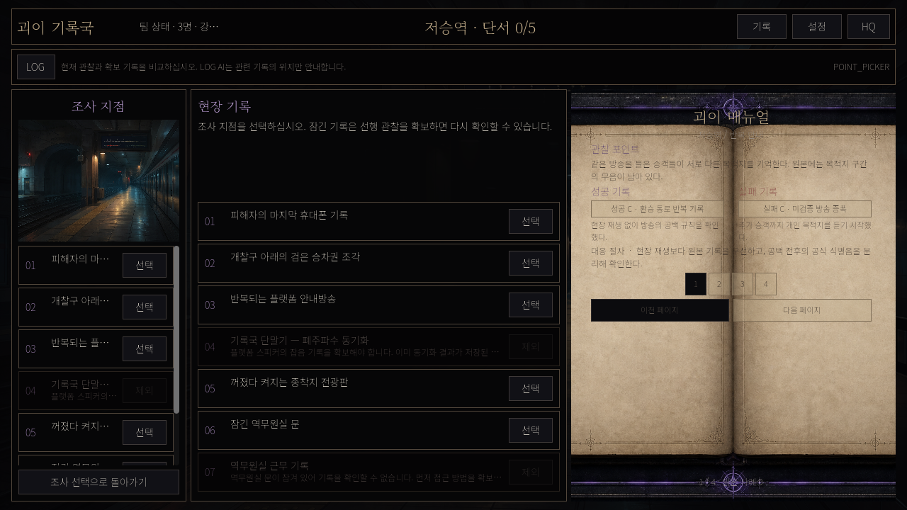
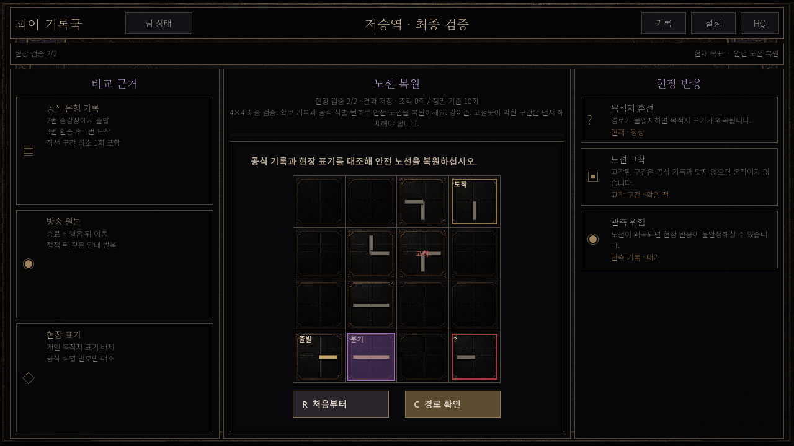
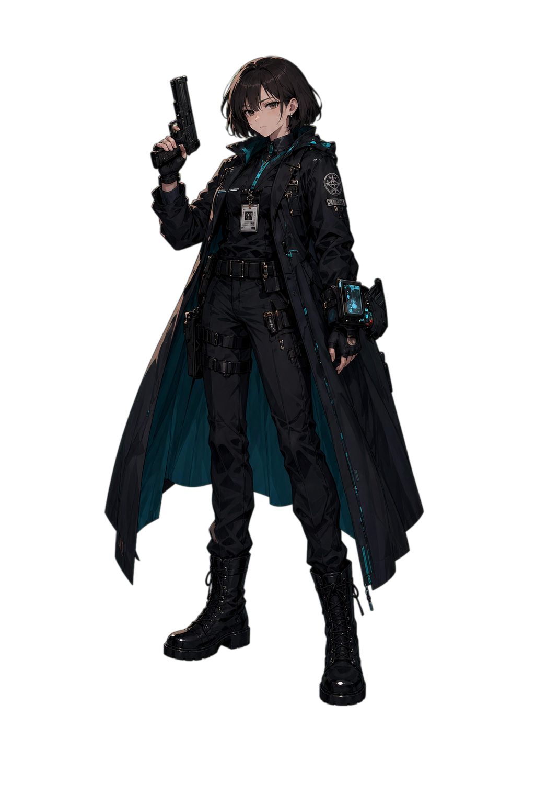
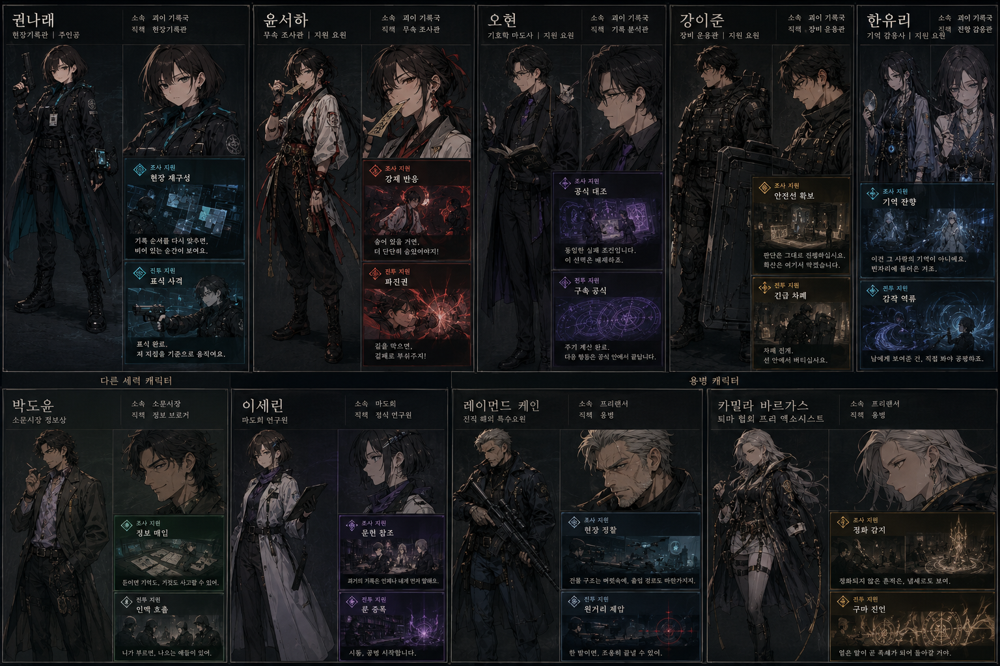

# 괴이 기록국 아트 기획서

> 문서 위치: `docs/art/ART_DIRECTION_PLAN.md` | 최신 이미지 정본: [`docs/art/IMAGE_INDEX.md`](IMAGE_INDEX.md) | 상세 부록: [`docs/planning/ART_PRESENTATION_PLAN.md`](../planning/ART_PRESENTATION_PLAN.md)

## 1. 아트의 역할

이 문서는 아트 팀의 활성 원본이다. 모든 화면과 자산이 **현대 도시의 기록물 같은 오컬트 수사**라는 감각을 유지하게 한다. 시각 연출은 감정과 정보 위계를 강화하지만 정답, 저장, 진행 상태를 결정하지 않는다.

### 핵심 시각 문장

낮에는 낡은 행정 기록과 도시 인프라, 밤에는 젖은 금속·희미한 형광등·비정상적인 보라 잔광이 남는다. 무서움을 큰 점프스케어가 아니라 “기록은 정돈되어 있는데 현실의 한 부분이 미세하게 어긋난다”는 감각으로 만든다.

## 2. 시각 언어

| 요소 | 기준 | 금지 |
|---|---|---|
| 색 | 먹색/검정 바탕, 낡은 황동·금색 얇은 테두리, 절제된 보라 강조, 위험 적색 | 둥근 청록 카드가 화면의 주 언어가 되는 것 |
| 재질 | 산화된 금속, 종이, 역 시설, 기록 장비, 젖은 콘크리트 | 과도한 광택·SF 홀로그램 과잉 |
| 문자 | 제목 18~22px Noto Serif KR, 본문 13~15px Noto Sans KR, 보조 11~12px | 이미지에 구운 한글·능력명·UI 문구 |
| 인물 | 현실적인 현대 복장과 직무 도구, 또렷한 실루엣 | 포즈/효과가 정보를 가리거나 캐릭터 동일성이 흔들리는 것 |
| 공포 | 빈 공간, 반사, 반복 표기, 미세한 점등 변화 | 반복 플래시·과도한 흔들림·읽기 방해 |

참고 작품의 레이아웃 감각은 관찰만 하고, 화면·문구·고유 UI·캐릭터 외형을 복제하지 않는다.

## 3. 대표 시각 기준 — 실제 게임 자산과 QA 캡처

아래 자료는 방향을 설명하기 위한 **실제 저장소의 자산·캡처**다. 외부 목업이나 이미지에 구운 문구를 기준으로 사용하지 않는다. 최신 이미지의 전체 목록과 상태는 [이미지 인덱스](IMAGE_INDEX.md)를 따른다.

### 저승역 조사: 기록·장소·매뉴얼의 정보 위계

- 장소 목록은 왼쪽에 한 번만 두고, 선택한 지점의 지문·판단·결과는 중앙에서 진행한다.
- 오른쪽 열린 책은 비교 근거를 제공하지만 정답을 대신 말하지 않는다.
- 이 캡처는 MVP-043 UI 증거다. 최신 진행 브랜치에서 레이아웃이나 텍스트가 바뀌면 같은 해상도 캡처로 교체하고 이미지 인덱스 상태를 갱신한다.

### 저승역 최종 검증: 근거·보드·현장 반응의 3열 구성

- 비교 근거 28% / 보드 44% / 현장 반응 28%의 정보 분리를 지킨다.
- 노선 연결은 황동빛 점등, 고착은 잠금, 위험은 적색으로 구분해 텍스트 없이도 상태의 성격을 보조한다.
- 보드는 규칙을 표현할 뿐, 색·이펙트만 보고 답을 알 수 있게 만들지 않는다.

### 권나래: 기록국의 현장 주인공 실루엣

  

- 어두운 현장복, 기록 장비, 청록 내부 포인트로 **현대 수사관·분석가**의 직무를 읽게 한다.
- 인물 아트는 UI 프레임·한글 텍스트·능력명을 이미지에 굽지 않고, 실시간 Godot 텍스트와 분리한다.
- 표정·포즈·컷인은 상황을 강조하지만 진행·저장·정답을 결정하지 않는다.

### MVP-043 캐릭터 패키지: 전체 라인업 원본

- 사용자 제공 원본은 `MVP-043_캐릭터_이미지_패키지_v1.0.zip`이며, 9명 개별 카드와 전체 라인업을 포함한다.
- ZIP의 모든 이미지가 `assets/source/mvp043_character_v1/`에 바이트 동일 사본으로 보존되었음을 확인했다. 세부 목록·검증 결과는 [이미지 인덱스의 패키지 감사](IMAGE_INDEX.md#mvp-043-캐릭터-패키지-원본-감사)를 따른다.
- 이 원본은 이름·직책·지원 문구가 이미지에 포함된 **참조 카드**다. 게임 화면에는 직접 쓰지 않고, 텍스트 없는 전신/반신/조사 지원/회수 지원 파생 자산만 사용한다.

## 4. 화면별 방향

### 텍스트 노벨 장면

- 상단은 날짜·장소·단계와 최소 자원만 보이는 얇은 기록 헤더다.
- 중앙은 배경과 현재 화자 한 명, 반응 인물 최대 한 명, 짧은 지문으로 읽기 리듬을 만든다.
- 하단은 화자명, 3~6줄 본문, 2~3개 선택지, 선택 직후 결과다. 텍스트가 가장 먼저 읽혀야 한다.

### 저승역 조사와 최종 검증

- 조사: 장소 이미지 20% / 현장 기록 43% / 열린 책 매뉴얼 37%의 밀도 있는 3열이다.
- 최종 검증: 비교 근거 28% / 보드 44% / 현장 반응 28%다. 보드의 연결은 황금빛 점등으로 읽히며 위험은 적색, 고착은 금속 잠금으로 구분한다.
- 저승역 화면은 공용 텍스트 노벨 셸로 대체하지 않는다.

### HQ와 준비

권나래의 하루 책상처럼 보이되, 행동 카드는 현재 반일·사건·서포트보다 앞서지 않는다. 연구·장비·외부 계약·세력 의뢰·기록은 탭/접힘으로 분리한다.

## 5. 자산 제작·등록 규칙

- 원본 참고 자산은 보존한다. 게임용 파생 자산은 새 경로에 만들고 원본을 덮어쓰지 않는다.
- 텍스트, 로고, UI 프레임, 고유 문장은 이미지에 굽지 않는다. Godot 실시간 텍스트와 9-slice/프레임을 결합한다.
- 인물 자산은 전신, 반신, 조사 지원, 회수 지원을 분리한다. 외부 접점은 반신과 HQ 접점 장면을 사용한다.
- 생성 자산은 경로, 출처/참조, 프롬프트, 크기, 알파 의도/결과, 용도, QA를 `assets/ASSET_MANIFEST.json` 또는 하위 manifest에 기록한다.
- 신규 이미지가 실제 화면에 들어가면 1280×720·1920×1080 캡처를 이미지 인덱스에 연결한다.

## 6. 최신 이미지 책임 원본

**최신 이미지와 방향성의 단일 원본은 이 문서와 [`IMAGE_INDEX.md`](IMAGE_INDEX.md)다.** 게임/UX/QA 문서는 같은 이미지를 복사하지 않고 인덱스 항목을 링크한다. 이미지 교체 시 다음 네 가지를 같은 커밋에서 갱신한다.

1. 이미지 인덱스의 상태·경로·참조·QA 캡처
2. asset manifest의 제작 메타데이터
3. 영향을 받는 화면의 QA 증거
4. 이 문서의 방향 또는 화면 규칙(변경됐을 때만)

## 7. 현재 자산 상태와 다음 일

| 영역 | 현재 확인 | 다음 확인 |
|---|---|---|
| 저승역 책·금속 패널·노선 타일 | textless 파생 자산과 manifest 존재 | 실제 장면 대비·타일 가독성 캡처 |
| 초기 5인·외부 4인 | 28종 캐릭터 컬렉션과 하위 manifest 존재 | 전신/반신/지원 장면의 런타임 여백·알파 |
| 기존 3인·괴이 컷아웃 | 원본 보존 및 투명 파생 자산 존재 | 장면별 크롭·대화 가독성 |
| 네 번째 사건 | 텍스트/상태 구현이 진행 브랜치에 있음 | 사건별 배경·초상·컷인의 필요 목록 확정 |
| 사운드 연동 | 시각 방향만 존재 | 사운드 기획서의 큐표와 실제 화면 동기화 |

## 8. 작업 때 함께 갱신할 것

UI 구조, 폰트, 색, 레이아웃, 캐릭터/배경/컷인/이펙트 자산을 바꾸면 이 문서와 이미지 인덱스를 갱신한다. 게임 규칙과 저장 데이터의 세부는 [게임 기획서](../design/GAME_DESIGN_PLAN.md)와 [프로그래밍 기획서](../programming/PROGRAMMING_ROADMAP_MVP.md)를 따른다. 실제 검증 결과는 [QA 기획서](../qa/QA_MASTER_PLAN.md)에 기록한다.

## 부록·근거

- 상세 표정·컷인·연출 규칙: [`docs/planning/ART_PRESENTATION_PLAN.md`](../planning/ART_PRESENTATION_PLAN.md)
- 이미지 제작 방법: [`docs/IMAGE_ASSET_WORKFLOW.md`](../IMAGE_ASSET_WORKFLOW.md)
- 전체 manifest: [`assets/ASSET_MANIFEST.json`](../../assets/ASSET_MANIFEST.json)
- 캐릭터 manifest: [`assets/characters/mvp043/ASSET_MANIFEST.json`](../../assets/characters/mvp043/ASSET_MANIFEST.json)
