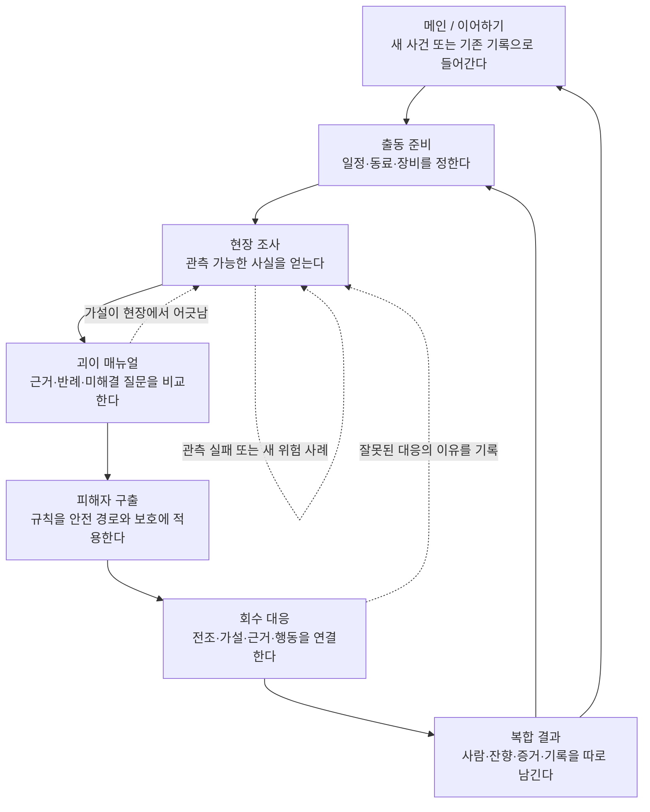

# 괴이 기록국 · 사람용 게임 블루프린트

> 상태: `사용자 승인 시각 참고 반영 / 최종 문서 검수 전`
> 기준: 2026-08-30의 현재 프로젝트 정본과 사용자 승인 시각 참고 묶음
> AI·구현 짝문서: `docs/design/PROJECT_AI_PRODUCTION_SPEC.md`
> 시각 참고: `docs/visual/blueprint-reference-pack/2026-08-30/README.md`

---

## 1. 한 줄 약속 · 괴이를 이기는 대신 이해하고 돌려보내는 게임

**플레이어는 현장기록관 권나래가 되어, 눈으로 확인한 근거로 괴이의 규칙을 밝히고, 피해자를 먼저 구한 뒤 현상을 안정화·회수한다.**

`괴이 기록국`은 현대 한국 도시의 일상적인 장소에서 시작한다. 지하철 승강장,
상가 골목, 기관 보관실처럼 익숙한 공간에 기억과 감정, 도시 환경이 얽힌 규칙이
발현한다. 플레이어는 강한 적을 쓰러뜨리는 대신, 무엇을 보았는지와 그 사실이
어떤 규칙을 뜻하는지를 구분한다.

### 이 게임에서 반복하는 핵심 동사

1. **관측한다.** 눈에 보이는 현상과 기록을 수집한다.
2. **해석한다.** 괴이 매뉴얼에서 근거와 반례를 비교해 가설을 세운다.
3. **보호한다.** 사람이 다치지 않도록 규칙을 피해자 구출에 적용한다.
4. **안정화한다.** 전조에 맞는 대응으로 잔향의 확산을 멈춘다.
5. **기록한다.** 사람, 현상, 증거에 남은 결과를 다음 판단에 남긴다.

### 하지 않는 것

- 괴이를 체력 0으로 처치하는 전투를 핵심으로 삼지 않는다.
- 능력치, 동료, 장비, 안내자가 플레이어 대신 정답을 말하지 않는다.
- 단일 등급 하나가 피해자·괴이·기록의 결과를 덮어쓰지 않는다.


*시각 참고: 메인·기록 장면에서의 기관성. 실제 게임 자산이나 완성된 메인 화면을 뜻하지 않는다.*

---

## 2. 플레이어는 어떤 하루를 보내는가 · 준비에서 기록까지

한 사건은 10일의 오전·오후 리듬 안에서 준비와 여파를 만든다. 그러나 이 시간표가
괴이의 정답을 알려주지는 않는다. 플레이어가 재미를 느껴야 하는 중심은
**조사 → 추리 → 회수**의 짧고 인과적인 판단 사슬이다.

| 시점 | 플레이어의 질문 | 플레이어가 하는 일 | 다음에 남는 것 |
| --- | --- | --- | --- |
| 출동 전 | “무엇을 준비하고 누구와 갈까?” | 일정, 동료, 장비, 사건을 정한다. | 준비 기회와 현장 접근 |
| 현장 조사 | “내가 실제로 본 것은 무엇일까?” | 관측·분석·보호 방법을 고른다. | 단서, 변화, 반증의 실마리 |
| 괴이 매뉴얼 | “어떤 규칙이 근거와 맞고, 무엇이 아직 모순일까?” | 출처가 남은 정보와 가설을 대조한다. | 현장에서 시험할 규칙 |
| 피해자 구출 | “이 규칙으로 사람을 어떻게 위험에서 떼어낼까?” | 안전 경로와 보호 절차를 적용한다. | 피해자 상태 |
| 회수 대응 | “지금 보이는 전조에는 무엇으로 대응할까?” | 전조·가설·근거·현장 행동을 연결한다. | 안정화와 잔향 상태 |
| 결과·기록 | “무엇을 지켰고, 무엇을 아직 모르는가?” | 결과를 읽고 다음 준비를 정한다. | 매뉴얼, 연구, 관계, 위험 사례 |


*시각 참고: 출동 전의 인원·메뉴얼·장비 판단. 실제 UI를 그대로 재현한 그림이 아니다.*

---

## 3. 전체 플레이 흐름 · 한 사건이 어떻게 끝까지 이어지는가



이 흐름에서 실패는 모든 것을 무효로 만드는 화면이 아니다. 잘못된 관측, 어긋난
가설, 부족했던 대응은 다음 판단을 위한 **위험 사례**로 남는다. 피해자를 구한
결과와 잔향을 회수한 결과도 분리되어 남는다.

### 흐름을 읽는 네 가지 약속

- **진행:** 출동 준비에서 관측과 추리로 들어간다.
- **보호:** 피해자 구출은 회수와 별개로 먼저 의미가 있다.
- **회복:** 틀린 대응은 이유와 함께 남아 다시 관측할 길을 만든다.
- **복귀:** 결과 뒤에는 다음 준비 또는 메인으로 돌아갈 수 있다.

---

## 4. 단계별 플레이 계약 · 화면마다 무엇을 보고 결정하는가

| 단계 | 들어오는 이유 | 처음 보는 것 | 하는 행동과 판단 | 끝나고 남는 것 | 다음 목적지 |
| --- | --- | --- | --- | --- | --- |
| 메인 | 게임을 시작하거나 이어 한다. | 사건의 분위기, 새 시작, 이어하기, 기록. | 새 사건 또는 기존 흐름을 고른다. | 현재 진입점. | 출동 준비 또는 사건 도입. |
| 출동 준비 | 현장에 갈 준비를 한다. | 남은 시간, 동료, 장비, 사건 조건. | 무엇을 먼저 준비할지 비교한다. | 준비의 방향. | 현장 조사. |
| 현장 조사 | 이상 현상을 처음 마주한다. | 장소, 관측점, 위험 신호, 선택 가능한 방법. | 보존·분석·보호 중 하나를 선택하고 결과를 읽는다. | 단서와 반증의 근거. | 매뉴얼 또는 다음 관측. |
| 괴이 매뉴얼 | 단서가 규칙을 뜻하는지 비교한다. | 원본 출처, 후보 해석, 모순, 아직 비어 있는 부분. | 가설을 세우고 현장에서 확인할 조건을 정한다. | 시험할 규칙. | 구출 또는 회수. |
| 피해자 구출 | 규칙을 사람 보호에 적용한다. | 보호 대상, 안전 경로, 금지 행동. | 위험에서 분리하는 순서와 경로를 선택한다. | 피해자 상태. | 회수 대응. |
| 회수 대응 | 남은 현상을 안정화한다. | 현재 전조, 연결된 근거, 보호 대상, 대응 범주. | 가설과 근거에 맞는 대응을 고른다. | 안정화·회수 또는 위험 사례. | 복합 결과 또는 재관측. |
| 복합 결과 | 사건이 남긴 것을 이해한다. | 사람, 잔향, 증거, 기억, 기록의 변화. | 결과를 읽고 다음 준비를 정한다. | 매뉴얼·연구·관계의 다음 질문. | 출동 준비 또는 메인. |

---

## 5. 핵심 장면 아틀라스 · 여섯 번의 시선 전환

| 장면 | 플레이어가 이루는 일 | 상태 |
| --- | --- | --- |
| 1. 메인 | 기록국의 사건으로 들어가거나 기록을 이어 간다. | 시각 참고 |
| 2. 출동 준비 | 인원·메뉴얼·장비를 맞춰 현장 대응을 준비한다. | 시각 참고 |
| 3. 현장 조사·메뉴얼 | 관측한 단서를 규칙과 비교한다. | 시각 참고 |
| 4. 피해자 구출 | 안전 경로와 보호 장비로 사람을 위험에서 분리한다. | 시각 참고 |
| 5. 회수 대응 | 전조에 맞춰 괴이를 억제하고 잔향을 안정화한다. | 시각 참고 |
| 6. 복합 결과 | 구조·안정화·기록을 서로 덮어쓰지 않고 남긴다. | 시각 참고 |

| 메인 | 준비 | 조사·매뉴얼 |
| --- | --- | --- |
|  |  |  |
| 피해자 구출 | 회수 대응 | 복합 결과 |
|  |  |  |

각 그림은 독립적인 콘셉트 포스터가 아니라, 앞 장면에서 얻은 정보를 다음 장면의
행동으로 바꾸는 경험을 설명한다. 실제 게임 자산과 화면 구현 상태는 별도로
검증한다.

---

## 6. 현장 조사와 괴이 매뉴얼 · 본 사실을 규칙으로 바꾸는 법

조사는 퀴즈의 답을 찾는 과정이 아니다. 플레이어는 현장에서 무엇을 보았는지,
어떤 방법을 선택했는지, 그 결과가 무엇을 지지하거나 반박했는지를 기억한다.

괴이 매뉴얼은 그 기억을 사용하게 만드는 공식 기록이다. 후보 문장과 빈칸은
정답을 즉시 채점하는 장치가 아니라, 출처가 남은 단서와 모순을 비교해 **현장에서
시험할 가설**을 만드는 자리다.

```text
관측 가능한 현상
→ 방법을 선택하고 결과를 읽는다
→ 단서의 출처와 맥락을 확인한다
→ 매뉴얼에서 서로 다른 해석을 비교한다
→ 구출과 회수에서 그 해석을 검증한다
```


### 플레이어가 믿을 수 있어야 하는 것

- 힌트는 주의를 이끌 수 있지만, 관측한 단서 자체를 대신하지 않는다.
- 그럴듯한 오해는 즉시 숨겨지지 않고 현장 검증을 통해 반증될 수 있다.
- 동료와 장비는 판단을 더 안전하게 만들 수 있지만, 숨은 규칙을 대신 고르지 않는다.

---

## 7. 피해자 구출 · 규칙을 사람에게 적용하는 첫 번째 시험

피해자 구출의 질문은 간단하다. **“이 사람을 지금 이 규칙의 위험에서 어떻게
떼어낼까?”** 플레이어는 조사와 매뉴얼에서 얻은 사실을 안전 경로, 보호 절차,
금지 행동에 적용한다.

구출은 회수 성공의 보너스가 아니다. 현상이 끝까지 안정화되지 못하더라도,
플레이어가 사람을 먼저 지켰다는 결과는 사라지지 않는다.


### 구출 장면의 기준

- 화면은 보호 대상과 안전 경로를 먼저 읽히게 한다.
- 장비와 동료의 역할은 보호 행위로 보이며, 공격 판타지로 바뀌지 않는다.
- 정답을 새로 숨기는 별도의 퍼즐보다 앞선 조사 규칙을 실제로 적용하게 한다.

---

## 8. 회수 대응 · 전조를 읽고 잔향을 안정화하는 순간

회수는 괴이를 쓰러뜨리는 장면이 아니라, 이미 이해한 현상이 지금 어떤 전조를
보이는지 읽고 확산을 멈추는 장면이다. 플레이어는 현재 전조를 본 뒤, 어떤 가설과
어떤 근거가 그 전조에 맞는지 확인하고, 그 다음에 현장 대응을 선택한다.

```text
현재 전조
→ 가설
→ 조사에서 확보한 근거
→ 보호·보조·현장 대응
→ 안정화 기준 도달
→ 잔향 회수
```


### 회수 장면에서 지켜야 할 것

- 메뉴얼을 보고 지시하는 역할, 현상을 억제하는 역할, 피해자를 보호하는 역할이
  행동·도구·공간 배치로 분명해야 한다.
- 잘못된 대응은 이유와 손실을 남기지만, 다음 관측과 회복 가능한 대응을 막지 않는다.
- 안정화한 잔향은 사람을 구한 사실을 덮어쓰지 않는다.

---

## 9. 복합 결과 · 한 줄의 승패 대신 남는 네 가지 기록

사건의 끝에서 플레이어는 단일 점수보다 다음을 따로 읽는다.

1. **피해자:** 무사히 분리했는가, 무엇이 남았는가.
2. **현상과 잔향:** 확산을 멈췄는가, 무엇을 안정화·회수했는가.
3. **증거와 규칙:** 어떤 가설이 확인되었고, 무엇이 위험 사례로 남았는가.
4. **다음 준비:** 연구, 관계, 후일담에서 무엇을 다시 살펴볼 것인가.

이 분리는 책임감을 남긴다. 구출 성공만으로 모든 것이 해결되지 않고, 회수 성공도
사람이 겪은 일을 지우지 않는다. 플레이어는 결과를 다음 매뉴얼과 다음 준비의
근거로 사용한다.


---

## 10. 첫 번째 사건 · 저승역에서 배우는 한 번의 완결된 경험

첫 세션의 대표 사건은 **저승역**이다. 심야 도시철도라는 현실적인 공간에 개인의
귀환 기억과 공식 교통 정보가 겹친다. 플레이어는 안내방송, 승강장, 승차권,
반복되는 경계에서 관측한 것을 매뉴얼과 구출·회수에 다시 사용한다.

| 저승역에서 배우는 것 | 플레이어가 확인하는 방식 |
| --- | --- |
| 괴이는 규칙을 가진 도시 현상이다. | 방송과 장소, 사람마다 달라지는 기억의 어긋남을 관측한다. |
| 가설은 실제 행동으로 검증해야 한다. | 관측 기록을 구출 절차와 전조 대응에 연결한다. |
| 사람과 잔향의 결과는 다르다. | 피해자 상태와 회수 상태가 복합 결과에 따로 남는다. |
| 실패도 기록이 된다. | 맞지 않은 대응의 이유가 다음 관측의 근거가 된다. |

첫 사건의 목표는 플레이어가 모든 비밀을 푸는 것이 아니라, **관측 → 해석 → 적용
→ 기록**이라는 괴이 기록국의 일하는 방식을 한 번 끝까지 경험하게 하는 것이다.

---

## 11. 시각 언어 · 현장 먼저, 인물과 기록은 그 위에

이 블루프린트의 시각 참고 묶음은 인게임 작업에도 재사용할 방향을 다음처럼
고정한다.

### 공간과 구도

- 조사·구출·회수의 핵심 장면은 실제 사건 현장을 먼저 보여 준다. 사무실은 메인,
  기록, 준비 장면에만 기관성을 설명하는 장소다.
- 한 장면은 `현상 → 대응 인물 → 보호 대상 또는 안전 경로`의 시선 흐름을 가진다.
- 캐릭터는 배경보다 한 단계 더 애니메이션적인 인상으로 두되, 한국 도시 공간의
  물성·거리·조명과 분리되지 않게 한다.

### 색과 정보의 역할

| 색과 재질 | 맡는 역할 |
| --- | --- |
| 검정·남청·청록 | 도시 현장, 야간 거리, 기관의 기본 톤 |
| 검정·금색 종이와 금속 | 괴이 매뉴얼, 기록국의 절차와 책임 |
| 보랏빛 분석선 | 근거를 적용한 억제와 구속 |
| 호박빛 장비등 | 보호·대피·안전 경로 |
| 제한된 검붉은색 | 실제 위험과 괴이의 확산 |

### 피하는 방향

- 모든 핵심 장면을 사무실이나 범용 마법 연구실로 바꾸는 것
- 거대한 HUD, 가짜 글자, 읽을 수 없는 장식 UI
- 종교 전시품, 마법사 의상, 처치 중심의 영웅 전투
- 특정 사건 하나에만 갇히는 배경 장식

---

## 12. 현재 기준과 다음 검수 · 이 문서가 약속하는 범위

이 블루프린트는 현재 프로젝트의 플레이 규칙과 사용자 승인 시각 참고를 사람에게
보여 주기 위한 문서다. 실제 게임에는 조사·구출·회수·결과 흐름의 기준선이 있으나,
매뉴얼 빈칸을 직접 완성하는 입력, 시간제 결과 표현, 일부 결과 연출은 앞으로
플레이어가 검증해야 할 설계 의도도 포함한다.

따라서 다음 검수에서는 두 가지를 분리해 확인한다.

1. **문서 검수:** 처음 보는 사람이 이 게임의 질문, 행동, 실패 뒤 회복, 결과를
   읽을 수 있는가.
2. **게임 검수:** 실제 화면에서 1280×720과 1920×1080 기준으로 단서, 메뉴얼,
   보호 대상, 전조, 입력 흐름이 읽히는가.

승인된 여섯 이미지는 사람용 블루프린트의 시각 참고다. 인게임에 같은 그림체와
구도를 적용할 때에는 각 자산의 실제 소비 위치, 해상도, 권리 기록, 레이어 구조,
사용자 검수를 별도로 확인한다.
