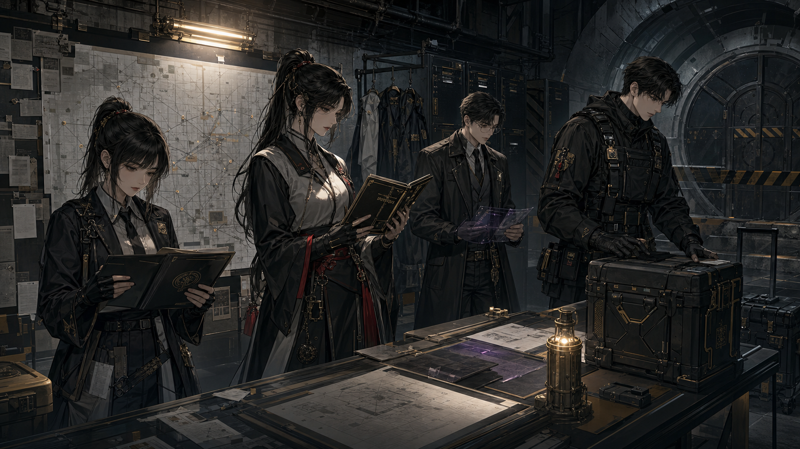
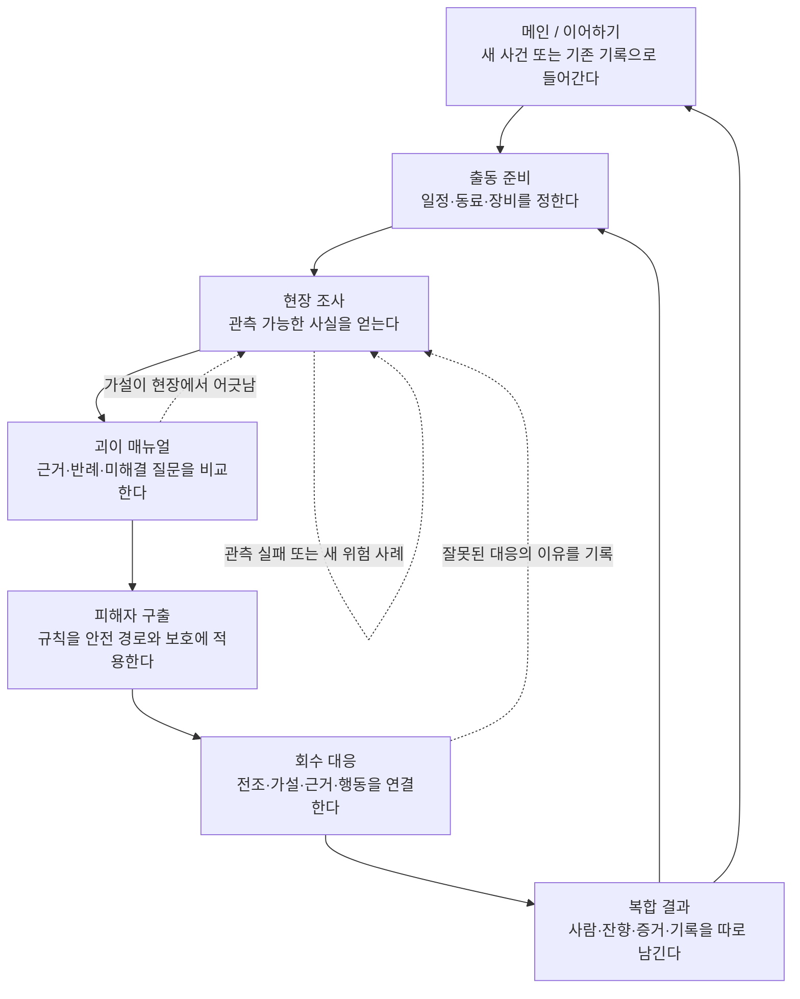
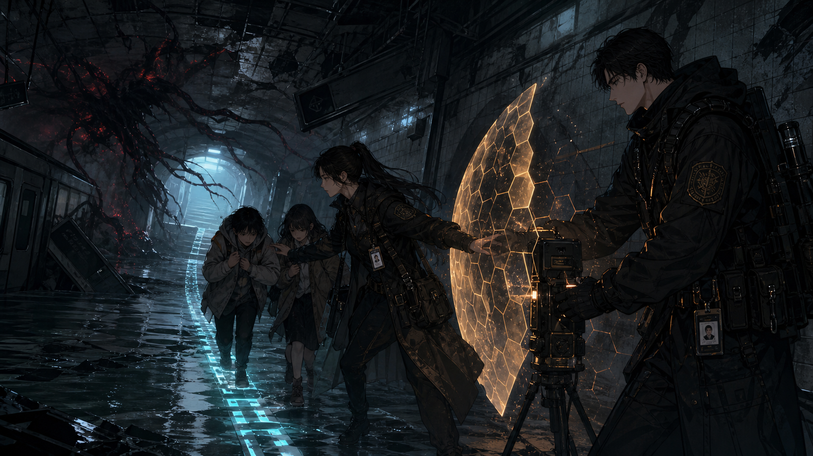
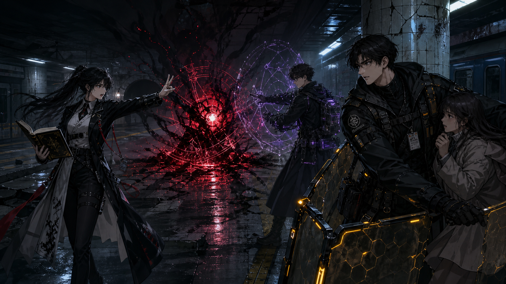
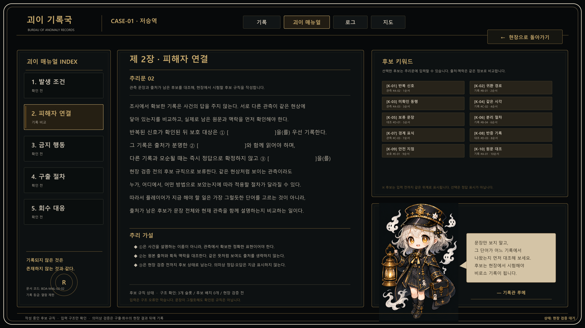
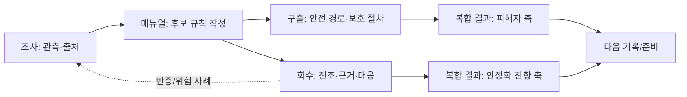

# 괴이기록국: 잔향 보고서 · 사람용 게임 블루프린트

> 상태: `CURRENT / RUNTIME_ALIGNED / HUMAN_QA_NOT_RUN`
> 기준: 최신 사용자 승인, `origin/main`의 M01/M04 공용 시스템, 그리고 M04 능동 작업트리의 회수·메인 메뉴 목표 구현을 대조했다.
> 정본 경계: 이 문서는 사람이 읽는 흐름·와이어프레임 owner다. 시스템 규칙은 `docs/CURRENT_PLANNING_CANON.md`, 현재 mutable 결정은 `docs/CURRENT_DECISION_OVERLAY.md`, 실제 현재 메인 구현은 코드·Scene·test가 소유한다.
> AI·구현 짝문서: `docs/design/PROJECT_AI_PRODUCTION_SPEC.md`
> 시각 참고: `docs/visual/blueprint-reference-pack/2026-08-30/README.md` — `USER_APPROVED / BLUEPRINT_REFERENCE_ONLY`, runtime asset·Human QA와 별개
> 현재 메인과 M04 목표의 경계: M04의 이중 시계와 정제된 action surface는 `PENDING_MAIN_RECONCILIATION`이다. 이 문서는 목표 UX를 구현 완료로 승격하지 않는다.

---

## 1. 한 줄 약속 · 괴이를 이기는 대신 이해하고 돌려보내는 게임

**플레이어는 현장기록관 권나래가 되어, 눈으로 확인한 근거로 괴이의 규칙을 밝히고, 피해자를 먼저 구한 뒤 현상을 안정화·회수한다.**

`괴이 기록국`은 현대 한국 도시의 일상적인 장소에서 시작한다. 지하철 승강장,
상가 골목, 기관 보관실처럼 익숙한 공간에 기억과 감정, 도시 환경이 얽힌 규칙이
발현한다. 플레이어는 강한 적을 쓰러뜨리는 대신, 무엇을 보았는지와 그 사실이
어떤 규칙을 뜻하는지를 구분한다.

### 이 게임에서 반복하는 핵심 동사

1. **관측한다.** 눈에 보이는 현상과 기록을 수집한다.
2. **해석한다.** 괴이 매뉴얼에서 근거와 반례를 비교해 가설을 세운다.
3. **보호한다.** 사람이 다치지 않도록 규칙을 피해자 구출에 적용한다.
4. **안정화한다.** 전조에 맞는 대응으로 잔향의 확산을 멈춘다.
5. **기록한다.** 사람, 현상, 증거에 남은 결과를 다음 판단에 남긴다.

### 하지 않는 것

- 괴이를 체력 0으로 처치하는 전투를 핵심으로 삼지 않는다.
- 능력치, 동료, 장비, 안내자가 플레이어 대신 정답을 말하지 않는다.
- 단일 등급 하나가 피해자·괴이·기록의 결과를 덮어쓰지 않는다.


*시각 참고: 메인·기록 장면에서의 기관성. 실제 게임 자산이나 완성된 메인 화면을 뜻하지 않는다.*

---

## 2. 플레이어는 어떤 하루를 보내는가 · 준비에서 기록까지

한 사건은 10일의 오전·오후 리듬 안에서 준비와 여파를 만든다. 그러나 이 시간표가
괴이의 정답을 알려주지는 않는다. 플레이어가 재미를 느껴야 하는 중심은
**조사 → 추리 → 회수**의 짧고 인과적인 판단 사슬이다.

| 시점 | 플레이어의 질문 | 플레이어가 하는 일 | 다음에 남는 것 |
| --- | --- | --- | --- |
| 출동 전 | “무엇을 준비하고 누구와 갈까?” | 일정, 동료, 장비, 사건을 정한다. | 준비 기회와 현장 접근 |
| 현장 조사 | “내가 실제로 본 것은 무엇일까?” | 관측·분석·보호 방법을 고른다. | 단서, 변화, 반증의 실마리 |
| 괴이 매뉴얼 | “어떤 규칙이 근거와 맞고, 무엇이 아직 모순일까?” | 출처가 남은 정보와 가설을 대조한다. | 현장에서 시험할 규칙 |
| 피해자 구출 | “이 규칙으로 사람을 어떻게 위험에서 떼어낼까?” | 안전 경로와 보호 절차를 적용한다. | 피해자 상태 |
| 회수 대응 | “지금 보이는 전조에는 무엇으로 대응할까?” | 전조·가설·근거·현장 행동을 연결한다. | 안정화와 잔향 상태 |
| 결과·기록 | “무엇을 지켰고, 무엇을 아직 모르는가?” | 결과를 읽고 다음 준비를 정한다. | 매뉴얼, 연구, 관계, 위험 사례 |



*시각 참고: 출동 전의 인원·메뉴얼·장비 판단. 실제 UI를 그대로 재현한 그림이 아니다.*

---

## 3. 전체 플레이 흐름 · 한 사건이 어떻게 끝까지 이어지는가



이 흐름에서 실패는 모든 것을 무효로 만드는 화면이 아니다. 잘못된 관측, 어긋난
가설, 부족했던 대응은 다음 판단을 위한 **위험 사례**로 남는다. 피해자를 구한
결과와 잔향을 회수한 결과도 분리되어 남는다.

### 흐름을 읽는 네 가지 약속

- **진행:** 출동 준비에서 관측과 추리로 들어간다.
- **보호:** 피해자 구출은 회수와 별개로 먼저 의미가 있다.
- **회복:** 틀린 대응은 이유와 함께 남아 다시 관측할 길을 만든다.
- **복귀:** 결과 뒤에는 다음 준비 또는 메인으로 돌아갈 수 있다.

---

## 4. 단계별 플레이 계약 · 화면마다 무엇을 보고 결정하는가

| 단계 | 들어오는 이유 | 처음 보는 것 | 하는 행동과 판단 | 끝나고 남는 것 | 다음 목적지 |
| --- | --- | --- | --- | --- | --- |
| 메인 | 게임을 시작하거나 이어 한다. | 사건의 분위기, 새 시작, 이어하기, 기록. | 새 사건 또는 기존 흐름을 고른다. | 현재 진입점. | 출동 준비 또는 사건 도입. |
| 출동 준비 | 현장에 갈 준비를 한다. | 남은 시간, 동료, 장비, 사건 조건. | 무엇을 먼저 준비할지 비교한다. | 준비의 방향. | 현장 조사. |
| 현장 조사 | 이상 현상을 처음 마주한다. | 장소, 관측점, 위험 신호, 선택 가능한 방법. | 보존·분석·보호 중 하나를 선택하고 결과를 읽는다. | 단서와 반증의 근거. | 매뉴얼 또는 다음 관측. |
| 괴이 매뉴얼 | 단서가 규칙을 뜻하는지 비교한다. | 원본 출처, 후보 해석, 모순, 아직 비어 있는 부분. | 가설을 세우고 현장에서 확인할 조건을 정한다. | 시험할 규칙. | 구출 또는 회수. |
| 피해자 구출 | 규칙을 사람 보호에 적용한다. | 보호 대상, 안전 경로, 금지 행동. | 위험에서 분리하는 순서와 경로를 선택한다. | 피해자 상태. | 회수 대응. |
| 회수 대응 | 남은 현상을 안정화한다. | 현재 전조, 연결된 근거, 보호 대상, 대응 범주. | 가설과 근거에 맞는 대응을 고른다. | 안정화·회수 또는 위험 사례. | 복합 결과 또는 재관측. |
| 복합 결과 | 사건이 남긴 것을 이해한다. | 사람, 잔향, 증거, 기억, 기록의 변화. | 결과를 읽고 다음 준비를 정한다. | 매뉴얼·연구·관계의 다음 질문. | 출동 준비 또는 메인. |

---

## 5. 핵심 장면 아틀라스 · 여섯 번의 시선 전환

| 장면 | 플레이어가 이루는 일 | 상태 |
| --- | --- | --- |
| 1. 메인 | 기록국의 사건으로 들어가거나 기록을 이어 간다. | 시각 참고 |
| 2. 출동 준비 | 인원·메뉴얼·장비를 맞춰 현장 대응을 준비한다. | 시각 참고 |
| 3. 현장 조사·메뉴얼 | 관측한 단서를 규칙과 비교한다. | 시각 참고 |
| 4. 피해자 구출 | 안전 경로와 보호 장비로 사람을 위험에서 분리한다. | 시각 참고 |
| 5. 회수 대응 | 전조에 맞춰 괴이를 억제하고 잔향을 안정화한다. | 시각 참고 |
| 6. 복합 결과 | 구조·안정화·기록을 서로 덮어쓰지 않고 남긴다. | 시각 참고 |

| 메인 | 준비 | 조사·매뉴얼 |
| --- | --- | --- |
|  |  |  |
| 피해자 구출 | 회수 대응 | 복합 결과 |
|  |  |  |

각 그림은 독립적인 콘셉트 포스터가 아니라, 앞 장면에서 얻은 정보를 다음 장면의
행동으로 바꾸는 경험을 설명한다. 실제 게임 자산과 화면 구현 상태는 별도로
검증한다.

### 매뉴얼 기록철 작업대 · 실제 추리 화면의 기준



*이 그림은 실제 사건의 정답·단서·화면 캡처가 아니라, 플레이어가 출처가 남은
키워드를 읽고 빈 규칙 문장을 작성하는 인게임 매뉴얼의 정보 구조를 보여 주는
사람용 시안이다. M01/M04의 실제 fullscreen workbench는 같은 **INDEX → 추리문 →
후보·출처 → 후보 규칙** 흐름을 draft-only로 소비한다. 그림 자체는
`USER_APPROVED / BLUEPRINT_REFERENCE_ONLY`이며, 제품 자산·Human QA와 별개다.
CASE-01 저승역에서만 루메의 저승역 복장을 쓴다. 다른 시나리오의 복장은 사건별
후보·사용자 승인·asset manifest·consumer 검증 뒤에만 바뀐다. 후보의 색·크기·정렬은
정답이나 변형 여부를 알려주지 않는다.*

이 화면은 현장 위에 여는 **전체 화면 매뉴얼 오버레이**다. 현장 조사와 회수 중에는
핵심 규칙만 간결하게 참고하고, 근거를 대조하거나 문장을 작성할 때 이 작업대로
들어온다. 따라서 현장의 긴박함과 추리의 읽기 밀도를 같은 좁은 패널에 억지로
넣지 않는다.

| 영역 | 플레이어가 처음 읽는 것 | 직접 하는 일 | 절대 하지 않는 것 |
| --- | --- | --- | --- |
| 왼쪽 · 매뉴얼 INDEX | 사건에서 지금 풀고 있는 단계와 기록 상태 | 발생 조건·피해자 연결·금지 행동·구출 절차·회수 대응 사이를 오간다. | 완료 표시로 의미상 정답을 알려 주지 않는다. |
| 가운데 · 빈 규칙 문장 | 번호가 붙은 빈칸, 관측 근거, 반증 기록, 미해결 질문 | 원본 기억과 문장 문맥을 비교해 후보를 배치한다. | 배치 직후 ‘정답’·‘오답’·추천 점수로 채점하지 않는다. |
| 오른쪽 · 후보 키워드 | 키워드 이름과 원본 출처, 획득 맥락, 획득 순서 | 왜 이 후보를 얻었는지 다시 열람하고 빈칸에 넣는다. | 정상·변조·보조 후보를 정답성 색이나 배지로 구분하지 않는다. |
| 하단 · 후보 규칙과 루메 | 구조 상태와 현장 복귀 목적 | 후보 규칙을 저장하고 구출·회수에서 검증할 준비를 한다. | 루메가 숨은 답이나 가장 안전한 후보를 대신 고르지 않는다. |

화면의 상태 언어도 정답표가 아니라 과정 기록이어야 한다.

```text
미작성 → 후보 배치 → 구조 확인 → 후보 규칙 → 현장 검증 → 확인된 규칙 / 위험 사례
```

`구조 확인`은 빈칸 수, 중복, 허용되지 않은 문장 형식만 확인한다. 그럴듯하지만
의미가 어긋난 규칙은 지워지거나 빨간 오답으로 표시되지 않고, 구출과 회수의 결과를
거친 뒤에야 위험 사례 또는 재관측 이유로 기록된다. `현장으로 돌아가기`는 이 규칙을
정답으로 확정하는 버튼이 아니라, 아직 검증되지 않은 **후보 규칙을 들고 사건 현장으로
복귀하는 버튼**이다.

#### 시나리오 보조의 경계

- **루메 — CASE-01 저승역:** 귀여운 소형 기록 보조다. 현재 저승역 매뉴얼에는
  은빛 웨이브 머리·호박빛 눈·검정/금색 도시철도 복장을 한 `LumePortrait`가 실제
  입력 UI와 함께 표시된다. 이름·초상·복장은 정답, 변조, 후보 적합성을 알려주지
  않는다.
- **기록관 아카 — M04 텍스트 보조:** M04 workbench는 전역 기관 보조 문구만
  표시하며 루메의 이름·초상을 재사용하지 않는다. 아카도 답을 고르거나 결과를
  자동 실행하지 않는다.

---

## 6. 현장 조사와 괴이 매뉴얼 · 본 사실을 규칙으로 바꾸는 법

조사는 퀴즈의 답을 찾는 과정이 아니다. 플레이어는 현장에서 무엇을 보았는지,
어떤 방법을 선택했는지, 그 결과가 무엇을 지지하거나 반박했는지를 기억한다.

괴이 매뉴얼은 그 기억을 사용하게 만드는 공식 기록이다. 후보 문장과 빈칸은
정답을 즉시 채점하는 장치가 아니라, 출처가 남은 단서와 모순을 비교해 **현장에서
시험할 가설**을 만드는 자리다.

```text
관측 가능한 현상
→ 방법을 선택하고 결과를 읽는다
→ 단서의 출처와 맥락을 확인한다
→ 매뉴얼에서 서로 다른 해석을 비교한다
→ 구출과 회수에서 그 해석을 검증한다
```


### 플레이어가 믿을 수 있어야 하는 것

- 힌트는 주의를 이끌 수 있지만, 관측한 단서 자체를 대신하지 않는다.
- 그럴듯한 오해는 즉시 숨겨지지 않고 현장 검증을 통해 반증될 수 있다.
- 동료와 장비는 판단을 더 안전하게 만들 수 있지만, 숨은 규칙을 대신 고르지 않는다.

### 플레이어가 실제로 밟는 세 화면 · 키워드에서 현장 적용까지

아래 표는 실제 게임의 판단 순서와 화면 책임을 설명한다. 블루프린트 그림은 runtime
스크린샷이 아니지만, **M01/M04에서 플레이어가 빈칸에 후보를 직접 배치하는 입력 UI는
구현되어 있다.** 이 입력은 draft-only이며, Human comprehension·접근성·최종 시각 품질은
아직 검증하지 않았다.

| 화면 | 플레이어에게 들어오는 것 | 플레이어가 직접 하는 일 | 화면을 나갈 때 남는 것 |
| --- | --- | --- | --- |
| A. 조사 결과 | 관측 기록, 선택한 조사 방법의 결과, **원본 출처와 획득 맥락이 남은 정상 키워드** | 획득한 이유를 읽고 다른 관측과 비교할 준비를 한다. | 매뉴얼 후보 풀에 넣을 수 있는 정상 키워드와 출처 기록. |
| B. 빈칸 매뉴얼 | 현재 문장, 관련 후보들, 각각의 원본 출처·획득 맥락·획득 순서 | 기억과 문맥으로 빈칸에 후보를 배치해 **후보 규칙**을 작성한다. | 구조적으로 유효한 후보 규칙. 의미상 정답·오답은 아직 표시되지 않는다. |
| C. 구출·회수 적용 | 후보 규칙, 보호 대상, 안전 경로, 현재 전조, 연결된 획득 기록 | 구출 절차를 정하고, 회수에서는 `전조 → 가설 → 근거 → 대응`을 직접 연결한다. | 확인된 규칙, 위험 사례, 재관측 이유와 피해자·잔향의 분리된 결과. |

#### A. 조사 결과 - 플레이어가 받는 것은 ‘단어’가 아니라 출처가 남은 근거다

조사가 끝났을 때 플레이어는 단순한 수집품을 얻지 않는다. 예를 들어 화면에는 `정상 키워드 [K-01]`, `원본 출처: 관측 기록 #A-02`, `획득 맥락: 어떤 현상과 어떤 방법의 결과로 얻었는가`가 함께 남는다. 이 세 정보가 있어야 다음 화면에서 기억을 더듬거나, 같은 뜻처럼 보이는 후보를 구별할 수 있다.

`[K-01]` 같은 표기는 **실제 사건 데이터의 새 키워드가 아니라 화면 형식 예시**다.
M01과 M04에는 source record를 가진 candidate pool과 deduction segment가 구현되어 있다.
다만 M05+의 후보 풀·변조 후보 확장은 아직 데이터와 consumer가 없으므로, 이
블루프린트가 새 사건의 정답이나 단서를 발명하지 않는다.

#### B. 빈칸 매뉴얼 - 플레이어가 규칙을 작성하지만, 시스템은 정답을 채점하지 않는다

매뉴얼에는 읽을 수 있는 규칙 문장과 빈칸이 있다. 후보 목록은 모두 같은 목록 안에 섞여 있으며, 플레이어가 즉시 보는 정보는 **후보 이름, 원본 출처, 획득 맥락, 획득 순서**다. 내부적으로 정상 키워드·한 변형 후보·사실 보조 후보가 구분될 수 있어도, 화면은 ‘정답 추천’, ‘변형 표시’, ‘이 빈칸에 맞음’ 같은 힌트를 주지 않는다.

시스템이 바로 막는 것은 빈칸 수·중복·허용되지 않은 문장 형식처럼 구조적으로 불가능한 경우뿐이다. 그럴듯하지만 의미가 어긋난 문장은 `후보 규칙`으로 남아야 한다. 그래야 구출과 회수에서 실제로 검증할 이유가 생긴다.

#### B-1. 왜 ‘전체 화면 기록철’이어야 하는가

이 작업은 지금의 현장을 꾸미는 작은 HUD가 아니다. 플레이어는 최소한 다음 네 가지를
한 번에 비교해야 한다: **매뉴얼 문장**, **후보의 원본 출처**, **반증 또는 미해결 기록**,
그리고 **현장으로 돌아가 실제로 시험할 후보 규칙**. 그래서 매뉴얼은 화면 오른쪽의
짧은 읽기 전용 서랍을 확대하는 방식보다, 현장을 잠시 가리고 집중해서 쓰는 기록철
형식이 적절하다.

다만 이 화면이 매번 긴 독서를 강요해서는 안 된다. 현장·구출·회수 화면에는 현재
후보 규칙의 짧은 요약과 ‘매뉴얼 열기’만 유지하고, 원문·출처·반증 비교는 이 전체
작업대에서만 수행한다. 이는 정보를 숨기는 방식이 아니라, **추리하는 시간과 대응하는
시간의 화면 역할을 분리하는 방식**이다.

#### C. 구출·회수 적용 - 같은 후보 규칙을 두 번 쓰되, 결과는 한 점수로 합치지 않는다

후보 규칙은 구출 미니게임에서 보호 대상의 안전 경로·순서·금지 행동을 판단하는 참조가 된다. 구출의 결과는 **피해자 상태**로 따로 남는다.

회수 대응에서는 후보 규칙이 자동 행동을 선택하지 않는다. 플레이어가 현재 전조를 읽고, 가설을 고르고, 이미 획득한 기록을 근거로 선택한 뒤, 현장 대응을 결정한다. 행동 뒤에는 후보 규칙이 확인되었는지 또는 왜 어긋났는지가 기록되며, 어긋난 경우는 위험 사례와 재관측의 출발점이 된다. 회수의 결과는 **안정화·잔향 상태**로 따로 남는다.

```text
관측 기록 + 정상 키워드(출처·맥락 포함)
→ 빈칸 문장에 후보를 배치
→ 구조 오류만 차단
→ 후보 규칙 작성 (즉시 정답 판정 없음)
→ 구출 미니게임: 안전 경로·보호 절차에 참조
→ 회수 대응: 전조 → 가설 → 근거 → 대응에 참조
→ 확인된 규칙 / 위험 사례 / 재관측 이유 기록
→ 피해자 상태와 잔향 상태를 따로 복합 결과에 보존
```

### 현재 구현과 승인 설계의 경계

| 항목 | 상태 | 이 문서에서 보여 주는 방식 |
| --- | --- | --- |
| 조사 결과와 매뉴얼 열람 | `IMPLEMENTED_M01_M04 / MACHINE_VERIFIED` | 관측 기록과 현재 정보를 확인하는 출발 화면. |
| 빈칸 매뉴얼에 후보를 직접 배치 | `IMPLEMENTED_M01_M04 / DRAFT_ONLY / MACHINE_VERIFIED` | source-backed 후보를 빈칸에 배치한다. 실제 입력 UI지만 semantic 정답 판정은 하지 않는다. |
| 매뉴얼 작성 직후 정답·오답 자동 표시 | 의도적으로 금지 | 문서에서도 점수·체크 표시 대신 `후보 규칙`으로만 표시한다. |
| 구출과 회수에서의 필드 검증 | 공통 흐름 기준선 구현, Human QA 미실행 | 보호 절차와 `전조 → 가설 → 근거 → 대응`의 연결로 보여 준다. |
| 플레이어 이해도·접근성 검증 | `NOT_RUN` | 최종 게임 화면으로 오해하거나 검증 완료로 취급하지 않는다. |

---

## 7. 피해자 구출 · 규칙을 사람에게 적용하는 첫 번째 시험

피해자 구출의 질문은 간단하다. **“이 사람을 지금 이 규칙의 위험에서 어떻게
떼어낼까?”** 플레이어는 조사와 매뉴얼에서 얻은 사실을 안전 경로, 보호 절차,
금지 행동에 적용한다.

구출은 회수 성공의 보너스가 아니다. 현상이 끝까지 안정화되지 못하더라도,
플레이어가 사람을 먼저 지켰다는 결과는 사라지지 않는다.


### 구출 장면의 기준

- 화면은 보호 대상과 안전 경로를 먼저 읽히게 한다.
- 장비와 동료의 역할은 보호 행위로 보이며, 공격 판타지로 바뀌지 않는다.
- 정답을 새로 숨기는 별도의 퍼즐보다 앞선 조사 규칙을 실제로 적용하게 한다.

---

## 8. 회수 대응 · 전조를 읽고 잔향을 안정화하는 순간

회수는 괴이를 쓰러뜨리는 장면이 아니라, 이미 이해한 현상이 지금 어떤 전조를
보이는지 읽고 확산을 멈추는 장면이다. 플레이어는 현재 전조를 본 뒤, 어떤 가설과
어떤 근거가 그 전조에 맞는지 확인하고, 그 다음에 현장 대응을 선택한다.

```text
현재 전조
→ 가설
→ 조사에서 확보한 근거
→ 보호·보조·현장 대응
→ 안정화 기준 도달
→ 잔향 회수
```


### 회수 장면에서 지켜야 할 것

- 메뉴얼을 보고 지시하는 역할, 현상을 억제하는 역할, 피해자를 보호하는 역할이
  행동·도구·공간 배치로 분명해야 한다.
- 잘못된 대응은 이유와 손실을 남기지만, 다음 관측과 회복 가능한 대응을 막지 않는다.
- 안정화한 잔향은 사람을 구한 사실을 덮어쓰지 않는다.

### 이중 시계 · 압박과 해소를 같은 화면에서 읽는 방법

`M04 회수 이중 시계`는 **사용자 승인 목표 UX**다. 능동 M04 작업트리에는 구현·기계
증거가 있으나 `origin/main`에는 아직 합류하지 않았으므로 이 문서의 상태는
`PENDING_MAIN_RECONCILIATION`이다. 현재 main의 공용 회수 기준선을 이 목표 구현으로
바꿔 적지 않는다.

| 시계 | 칸·방향 | 무엇이 움직이는가 | 플레이어가 느껴야 하는 변화 |
| --- | --- | --- | --- |
| 안정도 시계 — 8칸 | 목표 시계, 알맞은 대응으로 채운다 | 올바른 키워드·후보 규칙을 현재 전조에 연결하고, 억제·보호·봉쇄 방법을 맞게 수행할수록 전진한다. | 공간의 소음·왜곡·위협 시각이 한 단계 가라앉고, 회수 가능한 상태가 가까워진다. |
| 위험도 시계 — 6칸 | 위협 시계, 시간·실수·방치로 찬다 | 시간 경과, 잘못된 전조 대응, 피해자 방치처럼 실제 대가가 생길 때만 진행한다. | 현상이 확산되고 안전 경로가 좁아지며, 다음 선택이 더 급해진다. |

- 시간은 위험도만 자동으로 밀어 올린다. 안정도까지 자동으로 오르내리게 해
  숫자 두 개를 같은 벌로 쓰지 않는다.
- 맞는 **매뉴얼 키워드 + 방법**은 안정도를 전진시키고, 현상이 허용하는 경우에만
  위험도를 되돌린다. 항상 두 시계를 동시에 크게 바꾸지 않아 선택의 의미를
  흐리지 않는다.
- 실패의 대가는 장면에 맞춰 `위험도 진행`, `안정도 지연`, `보호 대상 위협`,
  `기회 상실` 중 하나를 우선 택한다. 이미 큰 손실이 있을 때 위험도까지 기계적으로
  더하지 않아 이중 처벌을 피한다.
- 한 칸이 움직일 때는 숫자만 바꾸지 않는다. 붉은 잔향의 범위, 전광판·방송의
  왜곡, 보호 경로, 팀의 대응 자세를 함께 갱신해 다음 선택의 근거를 준다.

#### 회수 행동 surface · 목표 wireframe

```text
┌ MODE / 현상명 ── [안정도 시계 8] ── [위험도 시계 6] ── 현재 전조 ┐
│ 보호 대상·팀 역할 │       괴이·공간·안전 경로       │ 근거·목표 │
│ 메뉴얼 지시        │  전조에 따른 장면 변화 / 억제    │ 다음 대가 │
├───────────────────────────────────────────────────────────────────┤
│ [공격] [보호] [보조]   → 전조 발생 시 [상황 대응]을 바로 제시       │
│                                              [괴이 매뉴얼 열기]     │
└───────────────────────────────────────────────────────────────────┘
```

- 상단에는 모드·현재 전조·**두 시계**만 둔다. 플레이어의 시선은 먼저 괴이와
  보호 대상, 그 다음 근거와 행동으로 흐른다.
- 기본 행동은 `공격 / 보호 / 보조`의 진입점이다. 특정 전조에는 이동·환경 조작·
  안내·봉쇄 같은 `상황 대응`이 별도 선택지로 나타난다.
- **괴이 매뉴얼 열기**는 우측 하단의 빠른 참조/전체 화면 진입점이다. 상단 고정
  탭이 아니며, 열어도 답을 추천하거나 행동을 자동 실행하지 않는다.
- 이전의 **대표 교체**, 별도 **회수 실행** 버튼은 이 목표 surface에 존재하지 않는다.
  안정도 조건이 충족되면 회수 전환은 명시적 상태 변화로 자동 처리하고, 팀 역할은
  화면의 위치·행동·보호 효과로 읽힌다.

---

## 9. 복합 결과 · 한 줄의 승패 대신 남는 네 가지 기록

사건의 끝에서 플레이어는 단일 점수보다 다음을 따로 읽는다.

1. **피해자:** 무사히 분리했는가, 무엇이 남았는가.
2. **현상과 잔향:** 확산을 멈췄는가, 무엇을 안정화·회수했는가.
3. **증거와 규칙:** 어떤 가설이 확인되었고, 무엇이 위험 사례로 남았는가.
4. **다음 준비:** 연구, 관계, 후일담에서 무엇을 다시 살펴볼 것인가.

이 분리는 책임감을 남긴다. 구출 성공만으로 모든 것이 해결되지 않고, 회수 성공도
사람이 겪은 일을 지우지 않는다. 플레이어는 결과를 다음 매뉴얼과 다음 준비의
근거로 사용한다.


---

## 10. 첫 번째 사건 · 저승역에서 배우는 한 번의 완결된 경험

첫 세션의 대표 사건은 **저승역**이다. 심야 도시철도라는 현실적인 공간에 개인의
귀환 기억과 공식 교통 정보가 겹친다. 플레이어는 안내방송, 승강장, 승차권,
반복되는 경계에서 관측한 것을 매뉴얼과 구출·회수에 다시 사용한다.

| 저승역에서 배우는 것 | 플레이어가 확인하는 방식 |
| --- | --- |
| 괴이는 규칙을 가진 도시 현상이다. | 방송과 장소, 사람마다 달라지는 기억의 어긋남을 관측한다. |
| 가설은 실제 행동으로 검증해야 한다. | 관측 기록을 구출 절차와 전조 대응에 연결한다. |
| 사람과 잔향의 결과는 다르다. | 피해자 상태와 회수 상태가 복합 결과에 따로 남는다. |
| 실패도 기록이 된다. | 맞지 않은 대응의 이유가 다음 관측의 근거가 된다. |

첫 사건의 목표는 플레이어가 모든 비밀을 푸는 것이 아니라, **관측 → 해석 → 적용
→ 기록**이라는 괴이 기록국의 일하는 방식을 한 번 끝까지 경험하게 하는 것이다.

---

## 11. 시각 언어 · 현장 먼저, 인물과 기록은 그 위에

이 블루프린트의 시각 참고 묶음은 인게임 작업에도 재사용할 방향을 다음처럼
고정한다.

### 공간과 구도

- 조사·구출·회수의 핵심 장면은 실제 사건 현장을 먼저 보여 준다. 사무실은 메인,
  기록, 준비 장면에만 기관성을 설명하는 장소다.
- 한 장면은 `현상 → 대응 인물 → 보호 대상 또는 안전 경로`의 시선 흐름을 가진다.
- 캐릭터는 배경보다 한 단계 더 애니메이션적인 인상으로 두되, 한국 도시 공간의
  물성·거리·조명과 분리되지 않게 한다.

### 색과 정보의 역할

| 색과 재질 | 맡는 역할 |
| --- | --- |
| 검정·남청·청록 | 도시 현장, 야간 거리, 기관의 기본 톤 |
| 검정·금색 종이와 금속 | 괴이 매뉴얼, 기록국의 절차와 책임 |
| 보랏빛 분석선 | 근거를 적용한 억제와 구속 |
| 호박빛 장비등 | 보호·대피·안전 경로 |
| 제한된 검붉은색 | 실제 위험과 괴이의 확산 |

### 피하는 방향

- 모든 핵심 장면을 사무실이나 범용 마법 연구실로 바꾸는 것
- 거대한 HUD, 가짜 글자, 읽을 수 없는 장식 UI
- 종교 전시품, 마법사 의상, 처치 중심의 영웅 전투
- 특정 사건 하나에만 갇히는 배경 장식

---

## 12. 런타임 정렬 와이어프레임 · 화면은 무엇을 덜고 무엇을 남기는가

아래는 이미지 시안이 아니라 Godot `Control`과 실제 입력 상태로 구현·검수할 수 있는
text-native 화면 계약이다. 화면별 이미지·텍스처는 실제 consumer가 확인될 때만 별도
asset workflow로 다룬다.

### A. 메인 메뉴 · 기관의 정체성과 다음 행동을 분리한다

```text
┌─────────────────────────────── 3-rail main menu ───────────────────────────────┐
│ [기관 문장·문장형 워드마크] │ [분리된 action plate 5개]       │ [현재 사건·기록] │
│ 괴이기록국: 잔향 보고서      │  본편 시작                     │ 사건 파일        │
│ 기록국의 책임·버전           │  이어서 하기                   │ 최근 기록        │
│                               │  Validation                    │ 저장 슬롯        │
│                               │  기록 보관실 / 설정 / 종료     │ 위험/보호 요약   │
└────────────────────────────────────────────────────────────────────────────────┘
```

- 메인 배경은 특정 골목·우산 사건이 아닌 기록국의 현대적 아카이브/연구실이다.
  동서양 주술 자료와 현대 장비는 **기관의 조사 도구**로 공존하되, 사무실을 사건
  현장처럼 쓰지 않는다.
- 가운데의 action plate는 서로 떨어진 별도 버튼이다. 우선 action의 이름과 한 줄
  설명이 읽히고, 장식 아이콘은 행동의 뜻을 보조한다.
- 제목은 `괴이기록국: 잔향 보고서`를 기본 텍스트 owner로 두고, 승인 워드타이포를
  적용하는 경우에도 접근 가능한 텍스트·focus·저해상도 fallback을 유지한다.

### B. 추리 매뉴얼 · 읽기와 판단을 한 화면에서, 정답은 현장에서

```text
┌ INDEX ──────┬──────────── 후보 규칙 작성 ────────────┬ 후보·출처 / 보조 ┐
│ 발생 조건   │ 관측 문장 + 빈칸 + 반증/미해결            │ 후보 카드 2열     │
│ 피해자 연결 │ [후보 배치] [구조 확인] [현장으로 돌아가기]│ CASE-01: 루메     │
│ 금지 행동   │ draft-only · 의미 정답은 표시하지 않음      │ M04: 아카 텍스트  │
└─────────────┴─────────────────────────────────────────┴──────────────────┘
```

- 이 화면은 `actual input UI`가 있는 전체 화면 기록철이다. 현장의 작은 패널에는
  현재 후보 규칙 요약과 **괴이 매뉴얼 열기**만 남긴다.
- 후보 카드의 출처·획득 맥락·획득 순서는 판단 근거이며, 색이나 자동 추천은 정답
  정보를 누설하지 않는다.

### C. 구출·회수 · 사람과 현상을 한 점수로 합치지 않는다



### 구현 상태 레이어

| 화면·계약 | `origin/main`의 현재 사실 | 승인 목표 / 다음 안전 작업 |
| --- | --- | --- |
| 메인 3-rail과 분리 action | Ver 4.3 관제실형 메뉴 구현, Human UI QA 미실행 | M04 능동 작업트리의 refined plates·워드마크는 `PENDING_MAIN_RECONCILIATION`; 먼저 최신 main과 독립 diff/회귀 대조가 필요하다. |
| M01/M04 매뉴얼 입력 | source-backed 후보, draft-only 빈칸 배치 구현·기계 검증 | 1280×720/1920×1080, 입력 피로, 신규 플레이어 이해는 `NOT_RUN`. |
| 회수 공용 기준선 | 전조·가설·근거·대응과 구출/결과 분리 구현 | 이중 시계·하단 빠른 매뉴얼·구형 행동 제거는 M04 목표 구현에서만 확인되어 `PENDING_MAIN_RECONCILIATION`. |

---

## 13. 현재 기준과 다음 검수 · 이 문서가 약속하는 범위

이 블루프린트는 현재 프로젝트의 플레이 규칙과 사용자 승인 시각 참고를 사람에게
보여 주기 위한 문서다. 실제 게임에는 조사·구출·회수·결과 흐름과 M01/M04의
매뉴얼 빈칸 입력이 있다. 이중 시계와 정제된 M04 회수/메인 메뉴 surface는 main
합류 전의 승인 목표이며, 시간 경과·세그먼트 값·결과 연출의 최종 체감은 플레이어가
검증해야 한다.

따라서 다음 검수에서는 두 가지를 분리해 확인한다.

1. **문서 검수:** 처음 보는 사람이 이 게임의 질문, 행동, 실패 뒤 회복, 결과를
   읽을 수 있는가.
2. **게임 검수:** 실제 화면에서 1280×720과 1920×1080 기준으로 단서, 매뉴얼,
   보호 대상, 전조, 두 시계, 입력 흐름이 읽히는가.

승인된 여섯 이미지는 사람용 블루프린트의 시각 참고다. 인게임에 같은 그림체와
구도를 적용할 때에는 각 자산의 실제 소비 위치, 해상도, 권리 기록, 레이어 구조,
사용자 검수를 별도로 확인한다.
