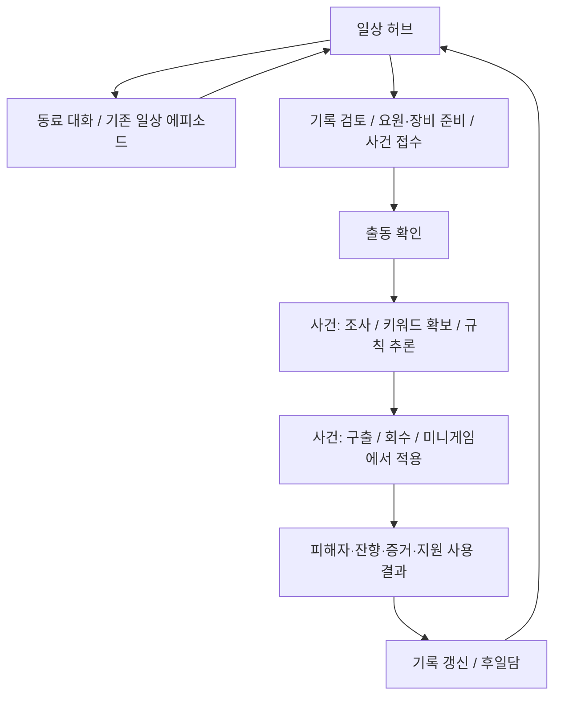

# 일상파트 / 사건파트 전환 설계

> 상태: APPROVED_DIRECTION / PLANNING_REVIEW_FIRST / PARTIAL_LOCAL_IMPLEMENTATION_HELD
> 최신 실행 제한: 사용자 ‘지금 바로 이미지 작업하지말고 기획쪽과 검토부터 먼저 진행하자’. 이미지 제작·추가 런타임 수정·구현 병합은 보류하고 기획과 검토를 먼저 한다.
> 결정: D-2026-09-10-DAILY-CASE-STRUCTURE
> 승인 근거: 사용자 ‘일정시스템은 없애자’ → ‘일상파트 / 사건파트(조사,회수)’ → ‘좋아 진행해’.
> 실제 구현 기준: main c82291101bf0a2bb4d821a12bca9f14070ee2886.
> 현재 기획 정본에 통합하기 전 검토용 successor 설계. 과거 10일 계약을 구현 완료로 덮어쓰지 않는다.

## 1. 방향과 경계

달력 관리가 아니라 일상에서 인물·기록·장비를 준비하고, 사건에서 숨겨진 규칙을 조사하여 구출·회수의 실제 행동에 사용하는 게임으로 전환한다. 일상파트를 없애거나 출동 메뉴 하나로 축소하지 않는다.

- 제거 승인: 오전/오후 배정, 반일 소비, 10일 제한, 날짜 기준 조기/정규 판정, 달력 자동 위험 증가, 대기·회복을 출동 전 필수 절차로 만드는 조건.
- 유지: 기존 일상 에피소드/선택 기록/동료 관계, 요원 편성/장비/기록 열람, 조사/매뉴얼/구출/회수/복합 결과, 현장 시계와 대응 타이밍.
- 금지: 대체 행동력/일상 행동 횟수/출동 횟수형 달력, 일상에서 정답 자동 지급, 기존 에피소드 ID 개명, 무조건 세이브 초기화, 기존 이미지 재승인 간주.
- 보호: M01 사건 규칙과 기존 저장의 단서·추론·선택·결과·기존 지원 사용 이력. 새 일상 대사·사건을 이번 구조 변경에 섞지 않는다.

## 2. 현재 구현에서 확인한 연결

| 실제 파일/책임 | 현재 동작 | 변경 방향 |
|---|---|---|
| scripts/scenes/preparation_scene.gd / _start_investigation | 일정 완성 및 investigation 배정 후 출동 | 사건/팀/장비 유효성과 진행 중 사건 충돌만 검사 |
| scripts/core/campaign_state.gd / begin_operation | day/slot/demo_ended/cycle_main_case_id 연결 | 한 번에 하나의 진행 중 사건만 보호; 10일 주기 잠금은 제거 |
| 같은 파일 / acknowledge_slot_result | 반일 이동, 날짜 증가, 의뢰 갱신 | 사건 결과를 확인하면 일상으로 복귀; 날짜/위험 자동 증가 없음 |
| 같은 파일 / grant_daily_understanding | 날짜당 1회, content ID 중복 방지, 상한 10 | 날짜 조건 폐기 후에도 콘텐츠별 중복 방지와 기존 총상한 보존 필요 |
| scripts/core/game_state.gd / get_available_daily_episodes | planning 상태, demo_ended=false, 미완료/발견 사건 조건 | 일상 상태에서 열기; 기존 콘텐츠 조건은 별도 보존 |
| 같은 파일 / begin_daily_episode, resolve_daily_episode_choice | 별도 씬, 선택/반응/완료 기록; 이미 반일 소비 없음 | 재사용. ‘daily’ ID는 파일/저장 호환 이름이지 날짜 진행 요구가 아님 |
| scripts/scenes/daily_episode_scene.gd | 대화·선택·결과와 준비실 복귀 | 일상파트의 재사용 가능한 기존 화면 |
| scripts/core/game_state.gd / M04 지원 조건 | dispatch의 m04_preparation_capacity 사용 | 기본 보조 유지 승인. 추가 효과·사용 횟수는 늘리지 않음 |
| scripts/scenes/result_scene.gd | dispatch_kind/day/slot로 M04 귀가 기억 페이지 구성 | 실제 구출/회수/지원 사용 사실만 표시; 날짜의 허구 인과 제거 |
| scripts/core/campaign_state.gd / load_save_data | 저장 operation의 day 일치 조건, demo_ended 복원 | legacy 날짜만으로 진행 중 사건을 버리거나 새 일상을 막지 않게 이관 |

`monthly_state_policy.gd`, `m01_first_session_orchestrator.gd`, `m01_first_session_runtime_sync.gd`는 이름만 보고 삭제하지 않는다. M01 경로·저장 migration에 연결된 별도 소비자이므로 구현 단계에서 전이별 회귀 대상으로 확인한다.

## 3. 목표 플로우와 입력

- 일상 진입만으로 시간이 지나거나 위험이 증가하지 않는다.
- 출동 확인은 사건과 편성을 보여준다. 대기·회복 배정은 요구하지 않는다.
- 사건의 임시 복귀/재개는 실제 허용된 경로만 재사용한다. 현장 중 임의 워프·위험 초기화 기능을 새로 만들지 않는다.
- 조사/회수의 시간·전조는 사건 규칙 소유다. 일상에서 열람한 노트만으로 세계의 실제 판정이 바뀌지 않는다.
- 결과 확인은 중복 실행되어도 보상·다음 사건 진행을 두 번 발생시키지 않는다.

## 4. 구조 대안과 비교

| 대안 | 장점 | 비용·위험 | 판정 |
|---|---|---|---|
| 기존 CampaignState를 역할별로 개정하고 기존 씬/API 경계 재사용 | 기존 기록·저장·일상 소비자 보존, 변경 추적 쉬움 | 시간 의존성 전수 추적 필요 | ADAPT / 권장 |
| 새 progression owner를 만들고 기존 상태에서 이관 | 날짜와 사건 상태 분리가 명확 | 두 상태 owner가 공존하는 중간 단계, 이관 규모 증가 | DEFER: 현행 owner 개정으로 해결되지 않을 때만 |
| 일정 로직을 끄고 사건별 독립 플레이로 운영 | 사건 내부 검증이 쉬움 | 일상/관계/후일담 연결 약화, 지속 기록 재설계 | REJECT: 사용자 의도와 불일치 |

기존 Base 런타임을 일괄 도입하거나 타 게임의 보상/기한을 복제하지 않는다. `docs/benchmarks/M04_BOUNDED_PREPARATION_CAPACITY_2026-08-30.md`는 과거 결정의 이유를 읽는 참고자료이며 휴식 필수 조건의 현재 권한은 아니다.

공식 원출처 확인(2026-09-10):
- https://bladesinthedark.com/progress-clocks — 시계는 상황/장애물의 진척과 위험을 표현한다. ADAPT: 현장 시계를 유지하되 달력과 분리. 해당 TRPG의 칸수/판정을 그대로 이식하지 않는다.
- https://www.inklestudios.com/overboard/ — 인물의 행동 기억과 8시간 제한을 명시한다. ADAPT: 선택 기억과 반응 연결. REJECT: 상시 시간 제한은 이번 승인 방향에 맞지 않는다.
- 위 자료는 공개 설계 비교이며 직접 플레이/소스 역공학/재미 검증 증거가 아니다.

## 5. 저장 이관 및 실패 처리

1. 기존 정상 save를 읽을 수 있어야 한다. 신규/중간 조사/중간 회수/결과 대기/일상 대화 중/10일 만료 저장을 각각 fixture로 검사한다.
2. day/time_slot/schedules는 legacy 입력으로 읽되 신형 출동·일상 이용 조건으로 소비하지 않는다. 과거 보고서의 날짜는 역사 정보로 보존 가능하다.
3. active_operation과 실제 scene의 조사/회수 상태를 보존한다. day가 다르다는 이유로 삭제하지 않는다. 유효하지 않은 ID는 기존 오류 처리로 안전하게 복귀시키고 명시한다.
4. demo_ended의 날짜 만료는 새 구조 진입을 막지 않는다. 실제 사건 실패/피해 결과와 혼동하여 성공으로 변환하지 않는다.
5. 완료 일상 ID, rewarded_daily_content_ids, 지원 획득/사용 이력을 보존한다. 반복 로드·반복 결과 확인으로 보상 중복 발생 금지.
6. 저장 버전/이관 표식 필요 여부는 현행 SaveMigrator/Validation 격리 계약을 확인해 결정한다. 새 형식을 구버전과 양방향 호환이라고 약속하지 않는다.
7. 원본 save를 프로젝트 내 격리 fixture로 검증한다. 사용자 save에 시험 이관을 직접 실행하지 않는다. 롤백은 코드만 되돌려도 되는 단계와 저장 복원이 필요한 단계를 구분한다.

## 6. 승인된 제품 결정 — M04 기존 회수 보조

휴식으로 `귀가 기억 고정`을 여는 조건은 폐기된다. 단, 그 기능을 기본 지급하거나 새 획득 조건을 발명하는 것은 동일한 결정이 아니다.

권장 검토안: **기존 귀가 기억 고정을 M04 출동 시 사용 가능한 기본 보조로 유지**하고, 회수에서 직접 선택하는 기존 사용 횟수/효과는 보존한다. 새 대기·필수 확인 클릭·일상 파밍을 만들지 않는다. 단서/정답을 제공하지 않으며 성공을 자동 보장하지 않는다. 기존 support 사용 여부에 따른 결과 인과는 유지한다.

대안: 선택형 무시간 준비 행동으로 해금(의미 없는 필수 클릭이 될 위험), 기능 자체 삭제(기존 회수 선택 손실). 사용자 ‘좋아 권장안대로 작업진행해’로 기본 보조 권장안은 승인됐다. 일정 제거/일상 유지/기본 보조를 재승인 질문으로 되돌리지 않는다. 이후 최신 지시는 구현 승인을 취소한 것이 아니라 기획·검토를 먼저 하라는 실행 순서 변경이다.

날짜별 일상 보상은 콘텐츠 ID별 1회와 현행 사건별 총상한을 보존하는 방향으로 검토한다. 날짜를 없앤 대가로 일상 열람 횟수를 제한하지 않는다. 실제 보상 소비자를 감사한 뒤 수치 영향이 생기면 별도 결정으로 올린다.

## 7. 구현 순서와 검증 수용 기준

| 단계 | 산출물/영향 파일 | 수용 기준 |
|---|---|---|
| 1 | CampaignState·GameState 및 GUT 회귀 | 무일정 출동, 일상 열기, 한 진행 사건 보호, 결과 복귀. 기존 저장 fixture 무손실 및 중복 실행 안전성 |
| 2 | preparation_scene / daily_episode_scene / main_menu | 일상 허브에서 대화·준비·사건 선택 노출. 날짜/일정 필수 UI 없음. 기존 지원 정책 확정 후 연결 |
| 3 | result_scene / 기록 표시 / M01 연계 | 날짜 기반 출동 판정 제거, 실제 피해자·회수·지원 결과 유지. 다음 사건에 주기 만료 대기 없음 |
| 4 | current canon/JSON/overlay/handoff/master GDD/roadmap/tests | 새 구조와 실제 구현 상태 분리, 폐기된 일정 계약은 historical로 분류. 기존 PDF는 삭제하지 않고 파생본 계약에 따라 갱신 |
| 5 | Godot 실제 실행 및 exact-head 검증 | 1280×720, 1920×1080에서 일상→조사→회수→결과→일상 및 저장 재개. Human/출시와 구분 |

예정 GUT: `tests/gut/test_daily_case_progression.gd`, `test_daily_case_save_migration.gd`, `test_daily_case_ui_routes.gd`. 문구 존재만 검사하지 않고 실제 메서드/씬/전이/보상을 실행한다. 각 변경은 RED→GREEN 후 기존 M01/M04 회귀를 실행한다.

## 8. 검토·상태·통합 경계

- 검토 1: 화면만 숨기기, 날짜 고정으로 보상 잠김, 휴식 기능 손실, 결과 후 다음 사건 잠금의 누락을 발견해 위 소비자/기준에 반영했다.
- 검토 2: 기존 day 만료 save, 중간 사건 day 불일치 복원, 새 일상 행동력으로의 변질, 단순 준비 메뉴로 일상 삭제되는 위험을 재검토해 보호 조건을 보강했다.
- 이 절의 설계 시점에는 runtime 변경 0이었다. 후속 승인으로 CampaignState/GameState/준비·일상·결과 화면의 부분 로컬 수정과 GUT 9개를 작성했다. 기존 mapper 5개 포함 14개/56 assertion이 통과했다. 전체 Python 490개에는 기존 Godot helper 계약 실패 1개가 남았다. 이 증거는 검토 중 로컬 상태이며 main 반영·전체 회귀·제품 완성 증거가 아니다.
- Godot 격리 QA에서 기존 상태 초기화 메서드를 시험 준비에 사용한 뒤, 1280×720 준비 화면의 사건 선택과 조사 시작 버튼 입력으로 InvestigationScene 진입을 확인했다. 메인 메뉴에서 시작한 일반 플레이나 조사→회수→결과 전체 통과를 의미하지 않는다. 새 이미지/Human/출시 검증 NOT_RUN.
- 열린 PR #359(재기획), #360(통합된 감사 역사), #361(시작 오류), #287(자산), #231(문서)는 read-only로 비교했다. 기존 PR에 임의 추가·병합하지 않는다. 최신 main 출발의 설계 브랜치만 사용한다.
- 통합 때 #359의 최신 방향 및 #361 함수 복구와 재대조한다. main에 없는 내용을 흡수하거나 구현 완료로 기술하지 않는다.
- Base v9.4.4 채택 고정 유지. 공용 변경/새 Skill/새 의존성 없음. 프로젝트 고유 교훈: 일정 제거는 UI가 아니라 출동·일상·보상·저장·결과 계약 변경이다.
- 현재 다음 작업은 아래 기획 검토다. 런타임 변경은 미완료 상태로 보존하며 이번 검토 문서 commit에 함께 넣지 않는다.

## 9. 기획 우선 전환 검토 — 2026-09-10

### 9.1 현행 조사와 책임 경계

이번 검토는 current main `c82291101bf0a2bb4d821a12bca9f14070ee2886`, 실제 로컬 diff, `AGENTS.md`, Current Planning Canon/JSON/Decision Overlay/Handoff, M01 Recovery Scene Packet과 실제 상태·씬 소비자를 대조했다. Base v9.4.4 lock은 유지한다. 옛 PDF와 그림은 참고 자료로 보존하며 새 시각 정본으로 승격하지 않는다.

| 검토 대상 | 현재 상태 → 문제 | 유지·수정 방향과 기대효과 | 상태 |
|---|---|---|---|
| 전역 진행 | 기획 정본·JSON은 여전히 10일/반일, 로컬 일부만 일상/사건으로 수정 | 최신 승인과 merged-main 구현 사실을 분리해 정본 동시 교정. 날짜 조건 재유입 방지 | UPDATE_IN_PLACE_REQUIRED |
| 일상 | 기존 에피소드·선택·반응 기록은 존재. 준비 화면에 항목이 있다고 대화 진입 검증이 된 것은 아님 | 대화→선택→기억→복귀를 독립 흐름으로 명세. 단순 출동 메뉴로 축소하지 않기 | KEEP_AND_VERIFY |
| 외부 의뢰 | 파견 실행은 `resolve_non_investigation_campaign_slot`와 요원 일정에 의존. 게시판 갱신도 반일 연결 | 일정 UI 제거로 의뢰가 고립되지 않도록 실행·갱신·보상 모델을 먼저 결정 | DESIGN_GAP |
| 매뉴얼 | 키워드 초안 저장과 구조 검사는 존재. 작성된 각 슬롯이 실제 구출/회수 입력을 바꾸는지는 별도 감사 필요 | 원시 관찰→후보→가설→현장 행동→반증을 한 행씩 추적. 빈칸 맞추기와 현장 행동의 분리 방지 | CONSUMER_TRACE_REQUIRED |
| 현장 시계 | 안정도·위험도 UI가 존재. 전역 날짜 제거와 현장 전조 시간을 혼동하면 안 됨 | 증가/감소 의미, 일시정지, 동시 도달, 실패 후 복구를 표로 검토 | KEEP_WITH_SEMANTIC_REVIEW |
| 결과·저장 | 날짜가 다른 중단 save/만료 save를 살리는 부분 테스트는 통과. 결과 복귀·일상 대화 저장의 전체 연결은 미검증 | 진행 중·중단·결과 대기·일상 선택·기존 지원 사용 이력별 무손실 기준 마련 | PARTIAL_MACHINE_EVIDENCE |
| 문서·작업 구조 | 역사 완료 선언, 새 승인, 로컬 구현이 여러 진입점에서 혼재 | 기존 owner를 갱신하고 이 설계는 상세 근거로 사용. 새 대시보드·별도 정본을 늘리지 않기 | UPDATE_IN_PLACE_REQUIRED |
| 이미지·모션 | 정보·입력 흐름이 아직 검토 중 | 제작 보류. 향후 실제 consumer·필요 상태·가림 영역·모션 시점을 확정한 뒤 제작 | HELD_BY_USER |

### 9.2 외부 사례 비교: ADOPT / ADAPT / REJECT

공식 공개 자료를 2026-09-10 다시 읽었다. 직접 플레이, 비공개 소스 분석, 재미 검증은 수행하지 않았다. 아래는 조사로부터의 프로젝트 적용 판단이며 외부 게임의 규칙을 프로젝트 요구사항으로 복제하지 않는다.

| Source and evidence | Observed pattern | Project fit and difference | 판정 |
|---|---|---|---|
| https://bladesinthedark.com/progress-clocks | 시계는 장애물·위험 상태를 나타내며 특정 해결 방법만 강제하지 않는다. 두 시계의 동시 완료 결과도 구분한다 | 현장 위험과 회수 진척을 분리하되 실제 시간·변화 조건은 이 게임에 맞춰 별도 정의. 단순 정답 횟수 카운터로 축소하지 않음 | ADAPT |
| https://www.inklestudios.com/overboard/ | 인물이 관찰한 행동을 기억하고, 8시간 제한이 존재한다 | 행동 기억과 후속 반응은 일상에 적합. 상시 제한시간은 일정 폐기 방향과 충돌하므로 가져오지 않음 | ADAPT 기억 / REJECT 상시 제한 |
| https://www.mobiusdigitalgames.com/outer-wilds.html | 탐사 도구로 위험을 확인하고 시간에 따라 변하는 환경을 탐색한다 | 현상 관찰과 도구 사용이 다음 행동 판단으로 이어지는 연결을 참고. 우주 배경·시간루프·전체 진행 구조는 도입하지 않음 | ADAPT 관찰→행동 / REJECT 구조 복제 |

benchmark_preflight_state: RESEARCHED_OFFICIAL_PUBLIC_SOURCES. 기존 프로젝트 소비자 비교를 첫 기준으로 사용했다. 다른 프로젝트 전수 검색이나 새로운 애드온 도입은 하지 않았다.

### 9.3 외부 의뢰: 검토할 실질 대안

아직 어느 대안도 구현·최종 승인으로 간주하지 않는다. 일정 제거의 빈자리에 새 의무 행동력이나 임의 보상 제한을 만들지 않는다.

| 대안 | 가치 | 위험·비용 | 장기 판단 |
|---|---|---|---|
| 기존 의뢰를 일상 선택 작업으로 유지, 사건 결과를 계기로 게시판 교체 | 기존 세력·요원·보상 소비자를 보존 | 사건 반복/취소/실패별 교체 조건과 보상 재수령 방지 설계 필요 | 우선 검토 권장. 진행 강제 조건으로 만들지 않음 |
| 각 의뢰를 고유 일상 이벤트로 재구성 | 행동 기억·인물 반응에 강하게 연결 | 대사·상태·콘텐츠 제작량 증가, 현행 랜덤 의뢰의 단순 기술 변경을 넘어감 | 후속 확장 후보 |
| 파견 의뢰를 보류하고 사건 내 회수 행동 의뢰만 유지 | 핵심 루프 집중, 경제 복잡도 감소 | 기존 일상 선택·보상·세력 접점 손실. 명시적인 콘텐츠 축소 결정 필요 | 대안으로 비교하되 자동 폐기 금지 |

재검토 조건: 의뢰가 필수 보조 획득이나 반복 파밍으로 변하거나, 다른 두 대안보다 경제·세이브 복잡도가 커지는 경우.

### 9.4 추리에서 행동까지: 검토용 한 장 연결표

사건 진실은 새로 만들지 않는다. M01 기존 Packet의 ‘목적지 합창’을 근거로 다음 연결을 감사한다. 문서 예시는 구현 완료 증거가 아니다.

| 단계 | 플레이어가 받는 것 / 판단 | 다음 단계로 넘겨야 하는 것 |
|---|---|---|
| 조사 | 서로 다른 목적지 기록에서 반복되는 공통 무음 구간을 관측 | 출처·관측 조건·획득 맥락이 붙은 기록 |
| 추리 | 개인 목적지 내용과 공통으로 남는 현상을 구분 | 플레이어가 작성한 규칙 초안과 참조 기록; 정답 배지 없음 |
| 회수 전조 | 여러 안내가 겹치고 같은 구간에 정적이 반복됨 | 현재 현상이 어떤 조사 기록과 연결되는지 판단할 정보 |
| 실제 적용 | 기존 설계의 공식 역 식별음을 공백에 삽입하는 대응 | 대상·시점·방법 입력. 매뉴얼을 채웠다는 이유만으로 자동 성공하지 않음 |
| 결과 | 개인 목적지 투영 약화/봉쇄창 등 관측 가능한 변화 | 무엇을 적용했고 무엇이 달라졌는지 기록. 입력 지연과 가설 오류를 혼동하지 않음 |

구출 미니게임에도 같은 검토를 별도로 수행한다. 회수 사례 하나를 설명했다고 구출 consumer까지 연결됐다고 선언하지 않는다. `M01_RECOVERY_SCENE_PACKET.md`에는 폐기된 7-command 목록도 남아 있어, 현행 core canon의 3-category/contextual 대응과 함께 정정해야 한다.

### 9.5 SWOT과 검토 순서

- Strength: ‘숨은 규칙을 알아내 실제로 사용해 생존’이라는 핵심과 사건 안의 압박이 연결된다.
- Weakness: 매뉴얼 작성·구출·회수가 같은 답을 반복 입력하는 시험처럼 느껴질 수 있다. 기존 소비자 연결과 피로도를 먼저 검토해야 한다.
- Opportunity: 일상에서 선택 기억과 후일담을 보존하고, 사건에서는 같은 지식을 다른 상황에 적용해 이해의 성장을 표현할 수 있다.
- Threat: 상시 시간제한 제거를 긴장감 제거로 오해하거나, 날짜 대신 필수 준비 클릭/파밍을 만들 위험. 낡은 정본이 이를 다시 정당화할 위험도 있다.

순서: (1) 승인/현행/보류 책임표 → (2) 일상 진입·대화·준비·복귀 flow → (3) 사건별 관찰-키워드-가설-구출/회수 consumer 표 → (4) 시계와 실패/재도전 규칙 → (5) 외부 의뢰·보상·save 영향 비교 → (6) 텍스트 와이어프레임과 정보 우선순위 → (7) 기획 검토 결과 공유. 이 단계에서는 이미지·새 모션·코드 작업으로 전환하지 않는다.

자체 검토 1: 외부 의뢰 고립, 일상 항목 존재를 진입 검증으로 착각, 14개 테스트를 전체 완료로 확대하는 위험을 명시했다.
자체 검토 2: 기본 보조의 재승인 요구 제거, 사례 기반 제안을 확정 규칙과 분리, 새 의뢰 갱신/경제를 무단 채택하지 않는 경계를 보강했다.
결론: 추가 planning gaps가 있어 CLEAN_REVIEW_EXIT/전체 기획 완료는 선언하지 않는다. Base 공용 승격은 NO_NEW_REUSE_LEARNING이며 기존 계약·Skill을 교체하지 않는다.
